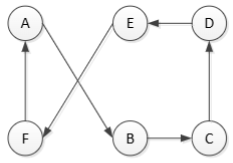
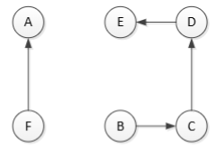
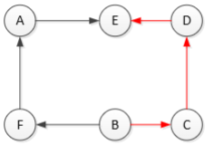
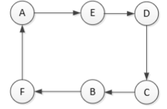

# Optimization Problems

### What We Learned Previously
- **Randomized algorithms**: Algorithms that use randomness as part of their logic.

### What We Will Learn in This Lecture
- **What is optimization?**
- **How to solve optimization problems using:**
  - Randomized algorithms
  - Local search: Hill Climbing
  - Stochastic local search algorithms (e.g., Simulated Annealing)

#### Evolutionary Computation Context
- **Evolutionary Computation** ⊆ **Randomized algorithms** (especially Stochastic Local Search algorithms) ⊆ **Heuristic algorithms** ⊆ **Search and enumeration algorithms**.

---

## 1. The Traveling Salesman Problem (TSP)


### Definition:
- **Given**: A list of cities and the distances between each pair of cities.
- **Sought**: The shortest route that visits each city exactly once and returns to the origin city.

### Example:
Consider a set of cities:
```
  A ---5--- B
  |        |
  10       5
  |        |
  C ---5--- D
```
- The shortest route needs to minimize the total travel distance.
- This is a **combinatorial optimization problem**.

### Real-World Applications:
- **Printed Circuit Board (PCB) design**
- **Scheduling problems** (e.g., NASA scheduling tasks)
- **Vehicle routing** (discussed later in Week 4)

### Computational Complexity:
- **Conceptually simple but computationally difficult**.
- **Benchmark problem** for evaluating combinatorial optimization algorithms.

---

## 2. Solving Optimization Problems


## What is Optimization?
Optimization is the process of finding the best or most efficient solution to a problem.

### Examples:
1. **Portfolio Optimization**: Given various investment options with expected returns and risks, determine the best combination to maximize returns while minimizing risk.
2. **Engineering Optimization**: Designing a product that minimizes material use while maintaining required strength and quality.

### Formal Definition:
1. Given a function f(x): A -> R, where A is the set of possible solutions.
2. We want to find an optimal solution x* in A such that:
   - Minimization: f(x*) <= f(x) for all x in A
   - Maximization: f(x*) >= f(x) for all x in A
3. Terminology:
   - Objective function: The function f(x) being optimized (to be minimized or maximized).
   - Feasible set: The set A containing all valid solutions.
   - Search space: The domain of f(x).
   - Candidate solutions: Elements of A.

---

### Categories of Optimization Problems

#### 1. Based on the Objective Function:
- **Linear vs. Non-Linear**  
  - *Linear:* Satisfies additivity (`f(x + y) = f(x) + f(y)`) and homogeneity (`f(αx) = αf(x)`).
  - *Non-Linear:* More general and can be much harder to solve.
    - **Convex vs. Non-Convex**  
      - *Convex:* Typically a single global optimum, well-studied solution methods.
      - *Non-Convex:* May have multiple local optima, often harder to handle.
- **Single vs. Multi-Objective**  
  - *Single:* Optimize one function.
  - *Multi:* Simultaneously optimize multiple objectives (often involves trade-offs).
- **Constrained vs. Non-Constrained**  
  - *Constrained:* Must satisfy additional conditions.
  - *Non-Constrained:* No explicit restrictions.

#### 2. Based on Solution Type:
- **Continuous vs. Discrete (Combinatorial)**  
  - *Continuous:* Variables take real values (e.g., ℝⁿ).
  - *Discrete:* Variables are integer or set-based (e.g., subsets, permutations).

---

### Optimization Algorithms
#### Exact Methods:
- **Mathematical Programming**: Linear programming, integer programming.
- **Search and Enumeration Algorithms**:
  - **Brute force**: Tries all possibilities (e.g., O(n!) complexity for TSP).
  - **Branch and bound**: Improves brute force by pruning unpromising solutions.

#### Heuristic Methods:
- **Randomized algorithms**
- **Local search algorithms** (e.g., Greedy search, Hill Climbing)

---

## 3. Solving TSP Using Heuristic Algorithms
### Why Not Exact Methods?
- **Brute force** is infeasible for large inputs (O(n!)).
- **Branch and Bound** methods still grow exponentially.
- **Linear programming** formulations are NP-hard.

#### Heuristic Approaches:
- **Randomized algorithms** (e.g., Monte Carlo, Las Vegas) [Not good for solving the TSP]
- **Local search algorithms**
- **Simulated Annealing**

---

## 4. Local Search Algorithms


### Concept
- Start with an initial solution and incrementally improve it.
- Move to a neighboring solution if it offers a better objective function value.
- The "neighborhood" is defined by a similarity measure.

#### Generic Local Search Algorithm:
```pseudo
x0 := generate initial solution
terminationflag := false
x := x0
while (terminationflag != true):
    Modify the current solution to a neighboring one v in A
    If f(v) < f(x):
        x := v
    If termination criterion met:
        terminationflag := true
Output x
```

#### Termination Conditions:
- Maximum number of iterations reached.
- No improvement for a certain number of iterations.

### Hill Climbing Algorithm
#### How It Works:
1. Start with an arbitrary solution.
2. Iteratively move to a better neighboring solution.
3. Stop when no further improvements can be made.

#### Types of Hill Climbing:
- **Simple Hill Climbing**: Moves to the first better neighbor found.
- **Steepest Ascent Hill Climbing**: Evaluates all neighbors and moves to the best one.

```pseudo
x0 := generate initial solution
terminationflag := false
x := x0
while (terminationflag != true):
    Modify the current solution to an *immediate* neighboring one v in A
    If f(v) < f(x):
        x := v
    If termination criterion met:
        terminationflag := true
Output x
```

#### Hill Climbing for TSP

In the Traveling Salesman Problem (TSP), the goal is to find a route (tour) that visits each city exactly once and returns to the starting point. For small numbers of cities, we can list all distinct tours and see how they relate.

- **2–3 cities: only one solution**
  - **2 cities**: A → B → A is the only valid tour, as reversing it (B → A → B) is identical.
  - **3 cities**: A → B → C → A has only one unique cycle after accounting for rotations and reversals.

- **4 cities: 3 distinct solutions**
  - Once we factor out rotations and reversals, three unique Hamiltonian cycles remain.
  - Example: A → B → C → D → A vs. A → B → D → C → A.

- **Immediate neighbors in TSP**
  - Two tours are "immediate neighbors" if they differ by swapping two edges.
  - Example:  
    - A → B → C → D → A  
    - Swap (C, B) and (A, D) → A → B → D → C → A  
  - This edge swap is a small but significant change used in heuristics like **2-opt**, which systematically swaps edges to improve the tour.

---

## 5. 2-Opt Algorithm


### Key Idea
- Given a TSP route, we **swap two edges** to generate an alternative solution.
- This process generates a **neighboring solution** by modifying the tour structure.
- The goal is to improve the total tour length by eliminating crossings in the path.

### Example
Consider the tour: 
```
A → C → B → D → A
```
If we swap two edges (C-B and A-D), the new route becomes:
```
A → B → C → D → A
```
This results in an improved (or different) tour.

### Steps of 2-Opt Algorithm
1. **Select two edges** in the current tour.


2. **Remove the selected edges**, breaking the tour into two segments.


3. **Reconnect the segments** using new edges to create a new valid tour.


4. **Reverse the order of one segment**, if necessary, to optimize the route.



### Pseudocode Implementation
```python
route = initial_TSP_solution()
for i, j in select_two_cities():
    new_route = route[:i] + route[i:j][::-1] + route[j:]
    if cost(new_route) < cost(route):
        route = new_route
return route
```

### Example for 6 Cities (A, B, C, D, E, F)
Initial route:
```
A → B → C → D → E → F → A
```
Swapping edges (B → C) and (E → F):
```
A → E → D → C → B → F → A
```
This results in an improved route.

---

## 6. Stochastic Local Search: Basic Ideas


### Fitness Landscape
A **fitness landscape** represents the relationship between different solutions and their objective function values. 
- **Local maximum**: A solution better than its neighbors but not the best overall.
- **Global maximum**: The best possible solution.
- **Plateau**: A region where multiple solutions have the same fitness value.

### Randomized Search vs Local Search
| Approach           | Strengths | Weaknesses |
|------------------|-----------|------------|
| **Randomized Search** | Good at exploring unknown regions (Good Exploration) | Poor at refining good solutions (Poor Exploitation) |
| **Local Search** | Good at refining solutions (Good Exploitation) | Stuck in local optima (Poor Exploration) |

### Stochastic Local Search: Main Idea
To **escape local optima**, stochastic local search introduces randomness in two ways:
1. **Random Restart**: Restart search from a new random solution.
2. **Random Non-Improving Steps**: Allow movements to worse solutions (Simulated Annealing).

---

## 7. Local Search with Random Restart


### Hill Climbing with Random Restart
Instead of being stuck in a local optimum, we restart from a new random point.

#### Algorithm
```python
for k in range(max_restarts):
    x = random_initial_solution()
    while termination_criterion_not_met():
        x = best_neighbor(x)
        store_best_solution(x)
return best_solution
```

### When to Use Random Restart
- **Few local optima** exist.
- The cost of restarting is low.

---

## 8. Simulated Annealing


### Introduction
**Simulated Annealing (SA)** is an optimization algorithm inspired by **metallurgy annealing**:
1. **Heat a material** to high temperature.
2. **Cool it down slowly** to find a more stable structure.
3. **Reduce randomness over time** for refinement.

### Simulated Annealing Algorithm
```python
x = initial_solution; e = objective_function(x) //Initial solution and objective function
x_best = x; e_best = e // Initial best soltuion
k = 0 //Count evaluations

while k < max_iterations:
    T = temperature(T)  # Update temperature
    x_new = neighbor(x)  # Pick a neighbor
    e_new = objective_function(x_new)

    if acceptance_probability(e, e_new, T) > random(0, 1): # Should we accept it?
        x, e = x_new, e_new  # Accept new state

    if e_new < e_best: # is this the new best?
        x_best, e_best = x_new, e_new  # Update best solution
    k += 1
return x_best  # Return best solution found
```

### Key Idea
- **Better solutions are always accepted**.
- **Worse solutions are accepted with a probability**:
  ```
  P = exp((e - e_new) / T)
  ```
- As **temperature decreases**, fewer bad moves are accepted.

### What Happens When T Reaches 0?
- The algorithm behaves like greedy hill climbing (only accepting better solutions).
- It may get stuck in a local optimum.
