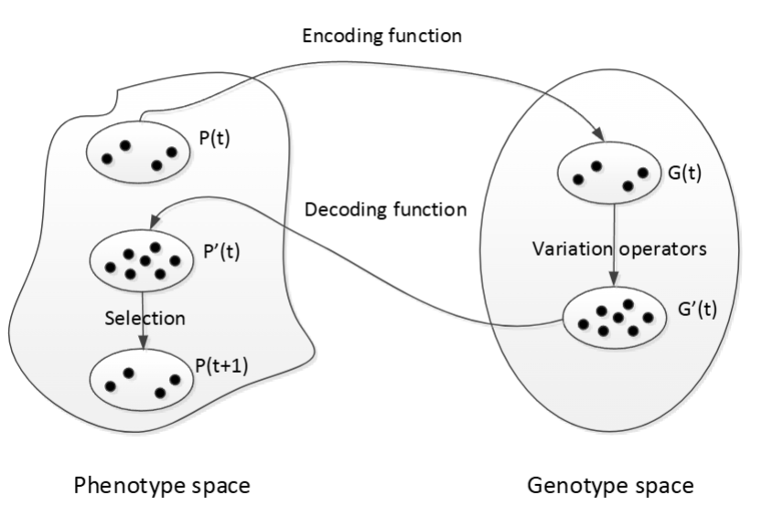

# i) Evolutionary Algorithms


## 1. Evolution

**Definition:** Evolution refers to the change in the inherited characteristics of biological populations over successive generations.

Key concepts:
- **Heritable Characteristics:** Traits passed from one generation to the next via DNA (e.g., eye color).
- **Genetic Variation:** The changes responsible for diversity within a species, driven by:
  - **Mutations:** Random changes in DNA. **Crossover:** Genetic recombination through reproduction. **Migration:** Movement of genes between populations.
- **Natural Selection:** The principle of "survival of the fittest," where beneficial traits become more common over time.

#### **Question:** How does this relate to optimization?
> **Fitness** in optimization corresponds to how well a solution performs.    
> **Individuals of a species** correspond to candidate solutions in an algorithm.

---

## 2. What are Evolutionary Algorithms?

**Definition:** Evolutionary algorithms (EAs) are metaheuristic optimization techniques inspired by natural evolution. Examples include:
- **Genetic Algorithms (GAs)**
- **Evolutionary Programming (EP)**
- **Evolution Strategies (ES)**
- **Differential Evolution (DE)**

### Characteristics of Evolutionary Algorithms
- **Population-based approach:** They are a stochastic local search optimization problem, where we maintain and evolve a group of candidate solutions.
- **Use randomness:** Introduce stochastic elements to avoid local optima.

---

## 3. Generic Evolutionary Algorithm

```
X0 := generate initial *population* of solutions
termination_flag := false
t := 0

Evaluate fitness of each individual in X0

while (termination_flag != true):
    Selection: Choose parents based on fitness
    Variation: Apply mutation and crossover to create new individuals
    Fitness calculation: Evaluate the fitness of offspring
    Reproduction: Replace less-fit individuals with offspring
    t := t + 1

    If termination criteria met: termination_flag := true

Output best solution found
```

---

## 4. Building Blocks of Evolutionary Algorithms

To apply an EA to a problem, the following are needed:
- **Representation:** How solutions are encoded.
- **Fitness Function:** Evaluates the quality of solutions.
- **Variation Operators:** Mutation and crossover to explore solutions.
- **Selection and Reproduction:** Guides the algorithm towards better solutions.

#### **Exploration vs. Exploitation**
- **Exploration:** Searching a wide range of possible solutions (variation operators).
- **Exploitation:** Refining known good solutions (selection and reproduction).

---

### Representation


**Definition**: Representation refers to encoding solutions in a way that allows the algorithm to manipulate and evaluate them.

- **Phenotype:** The actual solution (e.g., a number or a path in a graph).
- **Genotype:** The encoded form used by the algorithm (e.g., binary string).
- **Encoding Function:** Maps a phenotype to a genotype.
- **Decoding Function:** Maps a genotype back to a phenotype.

#### Types of Representations
- **Binary Representation** (traditionally used in genetic algorithms but inefficient):
  - Solutions encoded as bit strings.
  - Example: `{0,1,1,0,1,0}`
- **Real Number Representation:**
  - Used for continuous variables.
  - Example: `{3.5, -2.7, 1.8}`
- **Also, Permutation Representation, Random Key Representation and Problem-Specific Representation**

---
## 5. Binary Encoding

### 5.1 Example of Binary Representation:
A solution space mapped to binary (bits string):
```
Solution (x): -5    -3    0     3    5
Binary:        0000  0100 1000 1100 1111
```

### 5.2 Decoding Function Example:
Assume `x= {x1, x2, x3}` and `x ∈ [-5, 5]`. Use a bit string of length L= 12, therefore L/3 = 4 bits,  divided into three segments:
```
Binary:   1101 0001 1111
Segments: 13   1    15
Decoded:  3.667  -4.333  5
```

---

### 5.3 Variation Operators for Binary Genetic Algorithms

#### Mutation
- **Definition:** Randomly flips bits with a small probability `p_m` (mutation rate).
- The standard mutation rate `p_m = 1/L` but can be `p_m ∈ [1/L , 1/2]`
- **Example:**
  - Parent: `00101011`
  - After mutation: `01101001`
- With a small mutation rate, the effect is like a minor perturbation, similar to local search.  
- With a higher mutation rate, it can introduce more randomness, potentially leading to greater exploration.


---

#### Crossover  
- **Definition:** Combines genetic material from two parent solutions to create offspring.  
- **Types:**  
  - **One-Point Crossover:** A single crossover point is selected, and genes are swapped after this point.  
  - **N-Point Crossover:** Multiple crossover points are used, alternating segments between parents.  
  - **Uniform Crossover:** Each gene is randomly inherited from either parent with equal probability.  


Crossover Example  
```
One-Point Crossover "After the third gene":
Parent 1: 101|011
Parent 2: 110|100
Child 1:  101|100
Child 2:  110|011
```

---

### 5.4 Advantage of Binary Coding: Implicit Parallelism  

Binary coding in genetic algorithms enables **implicit parallelism**, allowing efficient exploration of large search spaces by evaluating multiple solution patterns (**schemas**) simultaneously.

#### **How It Works**   
- **Schemas Represent Patterns**  
  A **schema** is a template that groups similar solutions, reducing the need to test every individual separately.  
  - Example:
    | Chromosome/Schema | Representation  |
    |------------------|----------------|
    | **Chromosome 1** | `10110110`      |
    | **Chromosome 2** | `00100100`      |
    | **Schema 1**     | `*0**01*0`      |
    | **Schema 2**     | `****01**`      |

- **Massive Parallel Evaluation**  
  - A chromosome of length **L** contains **\(3^L\)** possible schemas (0, 1, or * per position).  
  - With **M** individuals, the algorithm processes up to **\(M \times 3^L\)** schemas at once.  
  - This allows a small population to explore a vast number of potential solutions efficiently.

- **Faster Optimization**  
  - The algorithm selects and evolves fitter schemas over generations.  
  - Instead of testing every possible solution, it **identifies promising patterns early**, leading to quicker convergence.  

---

### 5.5 Drawbacks of Binary Coding

#### 5.5.1 **Hamming Cliff Problem**
- Mutation in binary encoding can cause large or small jumps in phenotype values.
- Example:
    | **Genotypes (Binary)**   | `000` | `001` | `010` | `011` | `100` | `101` | `110` | `111` |
    |-------------------------|------|------|------|------|------|------|------|------|
    | **Phenotypes (Decimal)** |  0   |  1   |  2   |  3   |  4   |  5   |  6   |  7   |


- Problem: A one-bit mutation may result in a large jump (e.g., `011 → 100`, which is a jump from `3` to `4`).

**Solution: Gray Encoding**  

Gray encoding prevents large jumps in bit changes, ensuring **small changes in genotype (binary representation) lead to small changes in phenotype (decimal values).**  
This helps **avoid the Hamming cliff problem**, where consecutive binary values may differ by multiple bits.

**Conversion Using XOR Operation:**  
Gray encoding is derived from binary using the following formula:

$$
b_i =
\begin{cases} 
a_i, & \text{if } i = 1 \\ 
a_{i-1} \oplus a_i, & \text{if } i > 1
\end{cases}
$$

Where:
- \(a\) is the **binary number**.
- \(b\) is the **Gray encoded value**.
- $\oplus$ is the **XOR operation** (1 if bits are different, 0 if they are the same).

**Example**  
Let’s convert **Binary `101`** to **Gray Code**:
- **First bit remains the same:** $b_1 = a_1 = 1$
- **XOR the first two bits:** $b_2 = a_1 \oplus a_2 = 1 \oplus 0 = 1$
- **XOR the second and third bits:** $b_3 = a_2 \oplus a_3 = 0 \oplus 1 = 1$
Thus, **Binary `101` → Gray Code `111`**.

**Example 2: Binary to Gray Code Conversion**  
| **Binary Encoding**      | `000` | `001` | `010` | `011` | `100` | `101` | `110` | `111` |
|-------------------------|------|------|------|------|------|------|------|------|
| **Gray Encoding**       | `000` | `001` | `011` | `010` | `110` | `111` | `101` | `100` |
| **Phenotype (Decimal)** |  0   |  1   |  2   |  3   |  4   |  5   |  6   |  7   |

---

#### 5.5.2 **Redundancy Problem in Discrete Search Spaces**
- If the number of valid solutions is not a power of two, some binary strings will be redundant.
- Example:
  - Consider a set of solutions $A = \{0, 2, 3\}$ with $|A| = 3$.
  - If we use 2-bit encoding:
    - `00 → 0`
    - `01 → 1` (invalid -> infeasible)
    - `10 → 2`
    - `11 → 3`
  - The mapping is not efficient due to redundant strings (`01`).

#### 5.5.3 **Precision Issue in Continuous Search Spaces**
- Encoding a continuous number requires a finite-length binary string, leading to precision loss.
- Example:
  - $x \in [-5, 5]$ encoded as a 12-bit binary string.
  - The precision depends on $L$, making large-dimensional problems challenging.

---

## 6. Real-Valued Vector Encoding

A more natural representation for continuous optimization problems that avoids issues like redundancy and precision loss.

#### **Advantages:**
- No encoding/decoding overhead.
- Better numerical precision.
- Easily scalable for high-dimensional problems.

### 6.1 Representation:
- No distinction between genotype and phenotype; the chromosome is simply a vector of real numbers.

Each solution is represented as:
$x = [x_1, x_2, \dots, x_n] \in \mathbb{R}^n$

Each gene corresponds to a variable in the optimization problem.

---

### 6.2 Variation Operators for Real-Valued Encoding

#### Mutation
Randomly selects a parent with probability $p_m$ and modifies a gene.

**Types of Mutation:**
1. **Uniform Mutation**:
   - A gene $c_i$ is replaced with a random (uniform) value $c_i'$ within its allowed range $x_i ∈ [u_i, v_i]$.

2. **Gaussian Mutation**:
   - A gene $c_i$ is replaced with $c_i'$ by adding Gaussian noise.
   - $c_i' = \min(\max(N(c_i, \sigma_i), u_i), v_i)$
   - Where $N(c_i, \sigma_i)$ is a Gaussian distributuion with mean $c_i$ and standard deviation $\sigma_i$.
   - $u_i$ and $v_i$ are the lower and upper bounds of the variable, ensuring the mutation stays within valid limits.
   - The standard deviation $\sigma_i$ determines the spread of the mutation. Typically set as $\sigma_i = 1/10 l_i$ where $l_i = v_i - u_i$ is the length of the variable's allowed range. The Larger the $\sigma_i$, the bigger the changes.

3. **Non-Uniform Mutation**:
   - Mutation strength decreases over generations.
   - Formula:
     
 $$
 c_i' = \begin{cases}
 c_i + \Delta(t, v_i - c_i) & \text{if } \tau \geq 0.5 \\
 c_i - \Delta(t, c_i - u_i) & \text{if } \tau < 0.5
 \end{cases}
 $$

- Where t is the number of current generation and $\tau$ is a random number in the range [0,1] deciding whether the mutation increases or decreases $c_i$ and $\Delta(t, y) = y (1 - r^{(1 - \frac{t}{g_m})^b})$ determines how much mutation occurs

- Where r is a random number in the range of [0,1], and $g_m$ is the maximum number of generations and b is a constant controlling the mutation rate.

---

#### Crossover
Combines genetic material from two parents to create offspring.

**Types of Crossover:**

1. **Flat Crossover**:
   - Offspring genes are randomly selected within the range of parent values.
   - $h_i \in [x_i^{(1)}, x_i^{(2)}]$ or $h_i \in [x_i^{(2)}, x_i^{(1)}]$
   - **Intuition:** This allows uniform sampling within the range of the two parents, ensuring diversity in offspring.

2. **Simple Crossover**:
   - Selects a random crossover point and swaps genes beyond that point.
   - **Intuition:** This preserves partial structure from parents but introduces diversity by swapping sections.
   - Example:
     - Parent 1:    `[1.5, 2.3, | 3.8, 4.0]`
     - Parent 2:    `[1.2, 3.1, | 2.9, 5.2]`
     - Offspring 1: `[1.5, 2.3, | 2.9, 5.2]`
     - Offspring 2: `[1.2, 3.1, | 3.8, 4.0]`

3. **Whole Arithmetic Crossover**:
   - Uses a weighted average:
     $h_i^{(1)} = \alpha x_i^{(1)} + (1 - \alpha) x_i^{(2)}$
     $h_i^{(2)} = \alpha x_i^{(2)} + (1 - \alpha) x_i^{(1)}$
   - $\alpha$ is a random value between 0 and 1.
   - **Intuition:** This creates offspring that are a weighted average of the parents, which helps in smooth interpolation of solutions.

4. **Local Arithmetic Crossover**:    
    - Works like whole arithmetic crossover, but 𝛼 is a vector instead of a scalar.
    - Each gene in the offspring gets a different random weight.
    - **Intuition:** Provides more fine-grained control over crossover, allowing some genes to be more influenced by one parent than others.
    
5. **Single Arithmetic Crossover**:     
    - A single gene (feature) is chosen and replaced by the arithmetic mean of that gene from both parents.
  All other genes remain the same.
    - **Intuition:** Introduces a small, controlled variation in offspring, ensuring similarity to parents but with slight improvement.

7. **BLX- $\alpha$ Crossover**:
   - Offspring gene is sampled from a broader range than parents.
   - $h_i \in [h_{\min} - I \cdot \alpha, h_{\max} + I \cdot \alpha]$
     - $h_{\min}$ and $h_{\max}$ are min and max values among parents.
   - **Intuition:** Extends the search space beyond the parents' range, allowing more exploration and potentially better solutions.

---

## 7. Selection

### 7.1 Generic Evolutionary Algorithm

```
X0 := generate initial population of solutions
terminationflag := false
t := 0

Evaluate the fitness of each individual in X0.

while (terminationflag != true):
    Selection: Choose parents based on fitness.
    Variation: Apply mutation and crossover.
    Fitness calculation: Evaluate new individuals.
    Reproduction: Form new population by replacing least-fit individuals.
    t := t + 1
    If termination criteria met: terminationflag := true

Output best solution found
```

### 7.2 Selection Process
- **Not a search operator** but heavily influences search performance.
- **Precedes variation operators**: selects individuals for breeding.
- **Key Idea:**
  - Favors better solutions (higher fitness values).
  - Still allows selection of weaker solutions to maintain diversity.

#### **Why Select Inferior Solutions?**
- Prevents premature convergence.
- Avoids getting stuck in local optima.

### 7.3 Selection Schemes
1. **Fitness Proportional Selection (Roulette Wheel Selection)**
2. **Ranking Selection**
3. **Truncation Selection**
4. **Tournament Selection**
5. **(μ+λ) and (μ,λ) Selection**

---

### 7.4 Fitness Proportional Selection
- **Definition:** Each individual is selected with probability:
  \[
p_i = \frac{f_i}{\sum_{j=1}^{M} f_j}
  \]
  where \( f_i \) is the fitness value of individual \( i \) and \( M \) is the population size.
- **Key Properties:**
  - Higher fitness → Higher probability of selection.
  - Allows weaker individuals to be chosen occasionally.

#### **Scaling in Fitness Proportional Selection**
- **Problem:**
  - Early generations: "Super individuals" dominate → Premature convergence.
  - Later generations: Little fitness difference → Slow convergence.
- **Solution:** Apply **linear scaling**:
  \[
  f'_i = a + b f_i
  \]
  - Typically, \( a = \max(f) \), \( b = \frac{\min(f)}{M} < 1 \).

---

### 7.5 Ranking Selection
- Sort population from best to worst based on fitness.
- Selection probability \( p(γ) \) is assigned based on rank \( γ \):
  - **Linear Ranking:**
    \[
    p(γ) = \frac{α + (β - α)γ}{M - 1}
    \]
  - **Other Methods:** Exponential, Power, Geometric ranking.

---

### 7.6 Truncation Selection
- **Steps:**
  1. Rank individuals by fitness.
  2. Select top \( k \)% for reproduction (e.g., top 50% or 30%).
- **Characteristics:**
  - Deterministic selection (no randomness involved).
  - Commonly used in **Evolution Strategies (ES)**.

---

### 7.7 Tournament Selection
- **Steps:**
  1. Randomly select \( k \) individuals from population.
  2. Choose the fittest individual from the subset.
  3. Repeat until enough offspring are selected.
- **Common Variants:**
  - **Binary Tournament (\( k=2 \))** is the most popular.
  - Higher \( k \) → Higher selection pressure.

---

### 7.7 (μ+λ) and (μ,λ) Selection
- Used in **Evolution Strategies**.

#### **(μ+λ) Selection:**
- Parent population size: \( μ \).
- Generate \( λ \) offspring.
- Next population: Select top \( μ \) from **both** parents and offspring.

#### **(μ,λ) Selection:**
- Parent population size: \( μ \).
- Generate \( λ \) offspring.
- Next population: Select top \( μ \) from **only** offspring.
- Requires \( λ > μ \) to maintain diversity.

---

### 7.8 Selection Pressure
**Selection Pressure:** Degree to which selection favors better individuals.

#### **Effects:**
- **High selection pressure:** Faster convergence, but risks premature convergence.
- **Low selection pressure:** Slow convergence, but better exploration.

#### **Measurement: Take-over Time (\( τ^* \))**
- Time required for the entire population to be taken over by the best individual.
- **Longer \( τ^* \) → Lower selection pressure.**

| Selection Method | Take-over Time (\( τ^* \)) |
|-----------------|----------------------|
| Fitness Prop. Selection | \( M \ln M / c \) |
| Linear Ranking | \( 2 \ln (M-1) / (β-1) \) |
| Truncation | \( \ln M \) |
| Tournament (size \( k \)) | \( \ln M / \ln k \) |
| (μ+λ) Selection | \( \ln λ / \ln(λ/μ) \) |

---

## 8. Reproduction

### Genetic Algorithm Reproduction Strategies
- **Reproduction controls how the next generation is created.**
- **Types:**
  - **Generational Replacement:** Entire population is replaced.
  - **Steady-State Replacement:** Only a few individuals are replaced at a time.
  - **Elitism:** Top \( N \) individuals always survive to the next generation.
  - **Generational Gap:** Percentage of individuals carried over without modification.
