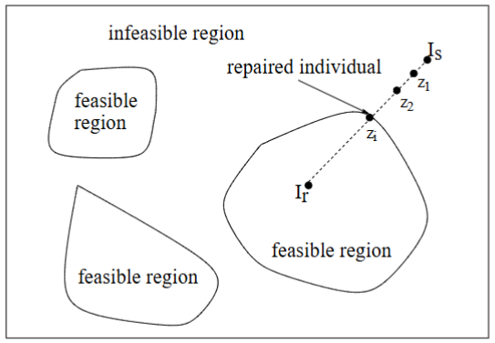

# Constraint Handling in Evolutionary Algorithms

---

## 1. Engineering Optimisation Problems

In many engineering design problems, the goal is to optimise certain performance measures (such as cost, weight, or material usage) while satisfying a set of constraints imposed by physical laws, regulations, or quality standards.


### Example: Spring Design

#### Description
- **Objective:** Minimize the weight of a tension/compression spring.
- **Design Variables:**
  - Wire diameter: $x_1$ (continuous variable, e.g., between 0.05 and 2)
  - Mean coil diameter: $x_2$ (continuous variable, e.g., between 0.25 and 1.3)
  - Number of active coils: $x_3$ (continuous or integer, e.g., between 2 and 15)

- **Constraints:**
  - Minimum deflection requirement.
  - Limits on shear stress.
  - Constraints on surge frequency.
  - Restrictions on diameters.

#### Constrained Optimisation Formulation

The spring design problem is formulated as follows:

**Objective Function:**

$$
\min_{X} \; f(X) = (x_3 + 2) \, x_2 \, x_1^2
$$

**Subject to Constraints:**

1. $\displaystyle g_1(X) = 1 - \frac{x_3^2}{1785 \, x_1^4} \le 0$
2. $\displaystyle g_2(X) = \frac{4x_2^2 - x_1x_2}{12566\,(x_2x_3^1 - x_1^4)} + \frac{1}{5108\, x_1^2} - 1 \le 0$
3. $\displaystyle g_3(X) = 1 - \frac{140.45\, x_1}{x_2^2\, x_3} \le 0$
4. $\displaystyle g_4(X) = \frac{x_2 + x_1}{1.5} - 1 \le 0$

#### Clarification & Explanation
- **Objective Function Insight:**  
  The function $f(X) = (x_3 + 2) \, x_2 \, x_1^2$ combines the design variables to reflect the weight of the spring. The term $(x_3 + 2)$ modulates the impact of the number of coils, while $x_2 \, x_1^2$ relates to geometric and material properties.
  
- **Constraints:**  
  Each constraint enforces a specific performance or safety requirement (e.g., stress limits, deflection limits). For example, $g_1(X)$ might ensure that the spring’s strength does not fall below a critical value.

---

### Engineering Optimisation Problems: General Concepts

- **Design Variables:**  
  - *Continuous:* e.g., dimensions like length, width, thickness.
  - *Integer:* e.g., number of gear teeth.
  - *Discrete:* e.g., selecting a value from a standard set defined by design codes.

- **Design Objective:**  
  This represents the target of the design process (e.g., minimising cost or maximizing profit) and is mathematically formulated as an objective function.

- **Constraints:**  
  They impose limitations due to resources (like budget or material limits) or strict design requirements (such as safety or regulatory standards).

- **Optimisation Software:**  
  Tools such as Matlab Optimisation Toolbox, Matlab Global Optimisation Toolbox, Red Cedar Technology, and Omniquest provide practical solutions for these problems.

---

## 2. Constrained Optimisation

### Definition

A **constrained optimisation problem** is one where the objective is to find the best solution subject to a set of restrictions.

**General Formulation:**

$$
\begin{aligned}
\min_{x} \quad & f(x) \\
\text{subject to} \quad & g_i(x) \le 0, \quad i = 1, \dots, m \\
& h_j(x) = 0, \quad j = 1, \dots, p
\end{aligned}
$$

- **$x$**: An $n$-dimensional vector $(x_1, x_2, \dots, x_n)$.
- **$f(x)$**: The objective function.
- **$g_i(x)$**: Inequality constraints.
- **$h_j(x)$**: Equality constraints.

**Search Spaces:**
- **$S$**: The entire search space.
- **$F \subset S$**: The feasible space where all constraints are met.

> **Note:** The global optimum in $F$ may differ from the global optimum in $S$ if the unconstrained optimum lies outside the feasible region.

### Types of Constraints

- **Linear Constraints:**  
  Easier to handle due to their simplicity.
  
- **Non-linear Constraints:**  
  Often more challenging because they can create a complex feasible region.

---

## 3. Constrained Handling Techniques in EAs

### 3.1 The Purist Approach (Death Penalty)

- **Method:**  
  Reject any solution that does not meet all constraints.
- **Drawback:**  
  This approach is very strict and may discard solutions that are nearly feasible and have good objective values, thereby reducing genetic diversity and potentially missing good search directions.

---

### 3.2 Penalty Function Approach

The penalty function approach converts a constrained optimisation problem into an unconstrained one by adding a penalty term to the objective function. This penalty term increases when a solution violates one or more constraints.

**Modified Objective Function:**

$$
f'(x) = f(x) + \text{Penalty Term}
$$

where the **Penalty Term** is typically:

$$
\sum_{i=1}^{m} r_i \, G_i(x) + \sum_{j=1}^{p} c_j \, H_j(x)
$$

- **$r_i, c_j \in \mathbb{R}^+$:** Penalty coefficients that determine how severely violations are penalized.

- **For Inequality Constraints:**

$$
G_i(x) = \max\bigl(0,\,g_i(x)\bigr)^\beta 
\quad (\beta \text{ is often } 2)
$$

> *Explanation:*  
> $\max(0,\,g_i(x))$ picks out the positive part of $g_i(x)$. If $g_i(x) \le 0$, there is no violation (the penalty is zero); if $g_i(x) > 0$, that positive amount indicates how much the constraint is violated, often squared ($\beta=2$) to emphasize larger violations more.

- **For Equality Constraints:**

$$
H_j(x) = \max\bigl(0,\,|h_j(x)|\bigr)^\gamma 
\quad (\gamma \text{ is often } 2)
$$

> *Explanation:*  
> $|h_j(x)|$ measures how far the solution is from satisfying $h_j(x) = 0$. If the constraint is perfectly satisfied, $|h_j(x)|=0$ and there is no penalty; otherwise, the violation amount $|h_j(x)|$ is often squared ($\gamma=2$) to heavily penalize larger deviations.

Summing these violation measures (scaled by $r_i$ and $c_j$) produces the overall penalty term. Adding it to $f(x)$ effectively discourages solutions that violate constraints by increasing their objective values, thereby guiding the search toward feasible solutions.

---

#### Techniques within the Penalty Function Approach

- **Static Penalties:**
  - Penalty coefficients $r_i$ and $c_j$ are fixed throughout the run.
  - Simple to implement.
  - Requires good domain knowledge to set proper values.  
  - **General Form (Example):**
$f'(x) = f(x) + \sum_{i=1}^{m} r_i \,\bigl(G_i(x)\bigr)^2$
    - $r_i \in \mathbb{R}^+$ are constants set before the algorithm starts.
  - Equality constraints are often converted to inequalities by allowing a small $\epsilon$:

$$
h_j(x) \Rightarrow h_j(x) - \epsilon \le 0.
$$


- **Dynamic Penalties:**
  - Penalty coefficients change with the generation number $t$.
  - **General Form:**
    
$$
f'(x) = f(x) + r(t)\sum_{i=1}^{m} G_i(x)^2 + c(t)\sum_{j=1}^{p} H_j(x)^2
$$

> where $r(t)$ and $c(t)$ are penalty coefficients that **change with the generation number** $t$.
  - As the algorithm progresses, it is often beneficial to increase the penalty for constraint violation so that the search increasingly focuses on feasible regions.


- **Adaptive and Self-Adaptive Penalties:**
  - The penalty values adjust automatically based on the current state of the search, without requiring a predetermined schedule.

---

#### Impact on Fitness and Selection

Using the modified objective function $f'(x)$ alters the fitness landscape:
- **Ranking Change:**  
  In a minimization problem where we define a penalized objective 
  $$\Phi(x) = f(x) + r \, G(x),$$ 
  changing the penalty coefficient $r$ can alter the ranking of solutions. For instance:
  - If $x_1$ has slightly better objective value $f(x_1)$ than $x_2$, but a much larger violation $G(x_1)$, then **increasing** $r$ can make $\Phi(x_1) > \Phi(x_2)$, reversing their order.
  - Conversely, if $x_1$ has higher $f(x_1)$ but lower $G(x_1)$ than $x_2$, a **smaller** $r$ might favor $x_1$.

Because selection in evolutionary algorithms depends on these penalized fitness values, **different values of \(r\) lead to different rankings** in the population, thus changing which solutions are more likely to be chosen as parents.

- **Selection Pressure:**  
  Since selection in an EA is based on fitness, the penalty term indirectly affects the probability of a solution being chosen as a parent.

---

### 3.3 Repair Approach

- **Method:**  
  Instead of discarding infeasible solutions, the repair approach modifies them (or "repairs" them) to satisfy the constraints.
- **Advantage:**  
  This method preserves potentially useful genetic material that might have been lost with strict rejection.

---

### 3.4 Hybrid Approach

- **Method:**  
  Combine two or more constraint handling techniques (e.g., a mix of penalty functions and repair methods) to exploit the advantages of each.
- **Advantage:**  
  It offers greater flexibility in handling a wide variety of constraints.


---

## 4. Stochastic Ranking

Stochastic Ranking is a rank-based selection scheme for handling constraints. It is self-adaptive, with very few parameters to tune, and has become one of the popular techniques for constraint handling due to its effectiveness and simplicity.

### 4.1 Why Use Stochastic Ranking?

Traditional penalty functions transform the fitness by adding a term that penalizes constraint violations. However, this indirectly changes the selection probability by altering the ranking. Stochastic Ranking, in contrast, directly addresses the ranking problem:
- **Directly Adjusts Selection:** Instead of modifying fitness values, it changes the order in which solutions are ranked.
- **Balancing Act:** It maintains a balance between the original objective (the fitness function $f(x)$) and the degree of constraint violation $G(x)$.

### 4.2 The Stochastic Ranking Algorithm

The algorithm essentially performs a bubble-sort-like procedure that iteratively compares and potentially swaps individuals based on both their objective value and their constraint violation. Below is the pseudocode:

```pseudo
Do until no change in ranking:
  For i = 1 to M - 1 do:
    u = U(0, 1) // u is a uniformly distributed random number
    If (G(x_i) = G(x_i+1) = 0) OR (u ≤ P_f) then:
      If f(x_i) > f(x_i+1) then swap(x_i, x_i+1)
    Else: If G(x_i) > G(x_i+1) then swap(x_i, x_i+1)
```


- **Variables:**
  - **M:** Total number of individuals.
  - **$G(x)$:** The sum of constraint violations for a solution $x$.
  - **$P_f$:** A constant representing the probability of using the objective function for comparison.

### 4.3 The Role of $P_f$

- **$P_f > 0.5$:**
  - Most comparisons use the objective function $f(x)$.
  - Infeasible solutions likely to occur.
  
- **$P_f < 0.5$:**
  - Most comparisons focus on $G(x)$, the degree of constraint violation.
  - Infeasible solutions are less likely to be favored, but it may also lead to a population with poorer overall fitness.
  
- **In Practice:**  
  $P_f$ is typically set between 0.45 and 0.5. Allowing some infeasible solutions helps the algorithm explore the search space more broadly—these solutions might be close to feasibility and, with slight modifications, can lead to high-quality feasible candidates.

---

## 5. Feasibility Rules

Feasibility Rules, offer an alternative approach by changing the selection mechanism directly rather than altering fitness values with penalties. This method uses simple, rule-based comparisons during tournament selection to decide which individuals should be favored.

### 5.1 The Feasibility Rules

When selecting individuals (often via binary tournament selection k=2), the following rules are applied:
1. **Between Two Feasible Solutions:**  
   The one with the better fitness (lower value in a minimization problem) wins.
2. **Between a Feasible and an Infeasible Solution:**  
   The feasible solution always wins.
3. **Between Two Infeasible Solutions:**  
   The solution with the lower degree of constraint violation $G(x)$ wins.

### 5.2 Pros and Cons

- **Advantages:**
  - **Parameter-Free:**  
    No extra parameters (such as penalty coefficients) need to be tuned.
  - **Simplicity:**  
    Easy to implement and understand.
  
- **Disadvantages:**
  - **Premature Convergence:**  
    Strictly preferring feasible solutions can sometimes cause the algorithm to converge too early to a local optimum, as diversity may be reduced.  
    *(Discussion point: Can the method be improved to balance exploration and exploitation better?)*
> This can be done by making the second case (Between a Feasible and an Infeasible Solution) choose infesaible solutions by random.
---

## 6. Repair Approach


The Repair Approach handles constraints by “repairing” infeasible solutions—altering them so they become feasible—rather than modifying the selection or fitness function. 


### 6.1 Basic Idea


- **Two Populations:**  
  - **Evolving Population:** Contains both feasible and infeasible individuals.
  - **Reference Population:** Consists solely of feasible individuals, which can be used as guides.
  
- **Objective:**  
  Convert an infeasible individual $I_s$ into a feasible one $z_i$ using information from a reference feasible individual $I_r$.

### 6.2 The Repairing Algorithm

The repair process is typically executed as follows:

```pseudo
Select a referncec individual I_r
Do until individual z_i feasible:
  z_i = a_i*I_s + (1-a_i)*I_r where 0 < a_i < 1
Calculate the fitness value of z_i: f(z_i)
if f(z_i)<=f(I_r) then Replace I_s by z_i
else
  u := U(0; 1) // u is uniformly distrubted random number
  if u <= Pr then Replace I_s by z_i
```
#### **Explanation:**
1. **Select a Reference:**  
   Choose a feasible individual $I_r$ from the reference population.
   
2. **Generate a New Candidate:**  
   Create a candidate solution $z_i$ by taking a linear combination of the infeasible individual $I_s$ and the reference $I_r$: $z_i = a_i I_s + (1 - a_i) I_r \quad \text{with } 0 < a_i < 1$
3. **Evaluate:**  
   Compute the fitness $f(z_i)$.
   
4. **Replacement Decision:**  
   - If $f(z_i) \le f(I_r)$, then replace $I_s$ with $z_i$.
   - Otherwise, with a probability $P_r$ (typically a small number, < 0.5), replace $I_s$ with $z_i$.

--- 

### 6.3 Implementation Considerations


- **Initial Reference Individuals:**  
  These can be obtained via preliminary exploration or by incorporating human expertise.
  
- **Selecting $I_r$:**  
  Options include random selection, selection based on fitness, or based on proximity (distance) between $I_s$ and potential references.
  
- **Determining $a_i$:**  
  Can be chosen uniformly at random between 0 and 1 or follow a predetermined sequence.
  
- **Choosing $P_r$:**  
  This probability is typically set to a value less than 0.5 to ensure that only promising repairs are accepted.
