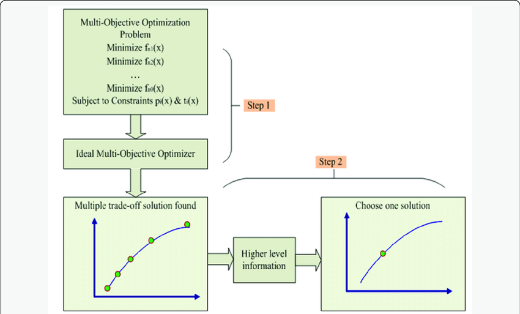
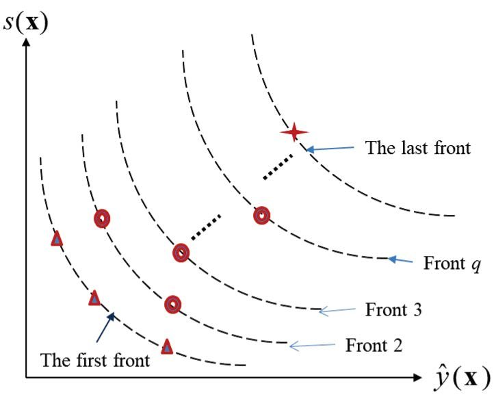

# Multi-Objective Optimization

Many real-world problems require balancing several conflicting objectives. For instance, when booking a flight, you may have to choose between:
- **Cost:** A cheaper flight might be less convenient.
- **Comfort:** A more convenient flight might be more expensive.

These trade-offs mean there is no single “best” solution—instead, there is a set of solutions that provide different compromises.

---

## 1. Basic Concepts in Multi-Objective Optimization


### 1.1 Domination

A solution **x(1)** is said to dominate another solution **x(2)** if:
1. **x(1) is no worse than x(2) in all objectives.**
2. **x(1) is strictly better than x(2) in at least one objective.**

> **Example:**  
> Suppose you are comparing two designs for a product based on cost and quality.  
> - **Design A:** Cost = \$100, Quality Score = 80  
> - **Design B:** Cost = \$120, Quality Score = 75  
> Here, Design A is cheaper and has a higher quality score, so it dominates Design B.

### 1.2 Pareto-Optimal Solutions

- **Pareto-optimal solutions** are those that are not dominated by any other solutions in the set.  
- When you consider all solutions in a set $P$, the subset $P'$ that includes every solution not dominated by another is called the **Pareto front**.

> **Clarification:**  
> Even if no single solution is best in all objectives, the Pareto front represents the set of “best compromises” available.

- **Algorithmic Note:**  
  Computing the non-dominated set can be done using algorithms with computational complexity of roughly $O(MN^2)$ (where $M$ is the number of objectives and $N$ is the number of solutions).

### 1.3 Pareto Front


The **Pareto front** graphically represents the trade-offs between objectives. Depending on the nature of the objectives (to be minimized or maximized), you can visualize different types of fronts:
- **Min–Min:** Both objectives are to be minimized.
- **Max–Max:** Both objectives are to be maximized.
- **Min–Max / Max–Min:** One objective is minimized while the other is maximized.

> **Example:**  
> Consider an optimization problem where you need to minimize both cost and time. The Pareto front would show solutions where improving cost further would lead to a longer time or vice versa. This curve of trade-off points helps decision-makers choose the solution that best meets their specific needs.

---

## 2. Preference-Based Approaches

### Weighted Sum Method

One common approach to transform a multi-objective problem into a single-objective one is by **constructing a weighted sum**:

$$
F(x) = \sum_{m=1}^{M} w_m \, f_m(x)
$$

- **$f_m(x)$:** The $m$ th objective function.
- **$w_m$:** The weight representing the relative importance of the $m$ th objective.

> **How It Works:**  
> The decision-maker specifies a weight vector $w$ that indicates the importance of each objective. The optimization then seeks to minimize (or maximize) the composite function $F(x)$.

### Challenges with the Weighted Sum Method

- **Choosing Weights:** It is often difficult to determine the correct weights without prior knowledge.
- **Non-Uniform Pareto Solutions:** The resulting Pareto-optimal solutions might not be uniformly distributed along the Pareto front.
- **Missing Some Solutions:** This method can sometimes fail to capture solutions in non-convex regions of the objective space.

> **In Practice:**  
> While weighted sums are straightforward, they require careful tuning and might not reveal all viable trade-offs between objectives.

---

## 3. Ideal Multi-Objective Optimization
  


### 3.1 Process
An ideal approach to multi-objective optimization is divided into two steps:

1. **Step 1:** Find a set of Pareto-optimal solutions.
2. **Step 2:** Select one solution from this set based on additional, higher-level criteria (preferences, constraints, or decision-maker inputs).

> **Clarification:**  
> - **Step 1** uses techniques (such as evolutionary algorithms) to explore the solution space and generate a diverse Pareto front.
> - **Step 2** then involves decision-making where further preferences are applied to choose the final solution.

> **Example:**  
> In designing a vehicle, multiple design alternatives (trade-offs between speed, fuel efficiency, and cost) are generated. In the next step, additional criteria like safety standards or brand values help choose the best design.


### 3.2 Goals
There are two primary goals when performing multi-objective optimization:

1. **Convergence:**  
   Ensure that the solutions generated by the algorithm are as close as possible to the true Pareto-optimal front to ensure optimality.
2. **Diversity:**  
   Maintain a wide spread of solutions so that the decision-maker can see the full spectrum of trade-offs.

---

## 4. Evolutionary Algorithms in Multi-Objective Optimization (MOEAs)

### 4.1 Why Evolutionary Algorithms?
**Evolutionary Algorithms (EAs)** are particularly well-suited for multi-objective optimization because:
- **Population-Based Search:**  
  They work with a whole population of candidate solutions, making it easier to find multiple, diverse trade-offs simultaneously.
- **Niche Preservation:**  
  Techniques like niche-preservation help in maintaining diversity, ensuring that different regions of the Pareto front are explored.

---

### 4.2 Adapting a Simple Genetic Algorithm for Multi-Objective Problems

To extend a basic Genetic Algorithm (GA) for multi-objective optimization, one key change is required: **modifying the fitness computation.**

#### Standard GA Workflow:
1. **Initialization:**  
   Generate an initial population.
2. **Evaluation:**  
   Compute the fitness of each individual.
3. **Reproduction:**  
   Select individuals based on fitness, then apply crossover and mutation.
4. **Iteration:**  
   Repeat the process until a termination condition is met.

#### Modification for MOEAs:
- **Fitness Assignment:**  
  Instead of using a single fitness value, assign fitness based on Pareto dominance (for example, through non-dominated sorting).
- **Selection:**  
  Use the rank (which Pareto front a solution belongs to) to guide selection.

> **Clarification:**  
> Although the overall GA structure remains the same, the evaluation step now considers multiple objectives, allowing the algorithm to favor solutions that contribute to a diverse Pareto front.


### 4.3 Identifying the Non-Dominated Set

To identify the Pareto-optimal (non-dominated) set from a given population $P$, you can use the following steps:
1. **For each solution $i$ in $P$:**
   - Compare it against every other solution $j$ (where $j \neq i$).
2. **Determine Dominance:**
   - If any $j$ dominates $i$, then $i$ is not included in the non-dominated set.
   - Otherwise, include $i$ in the non-dominated set $P'$.
3. **Complexity:**  
   This procedure has a computational complexity of $O(MN^2)$ (with $M$ objectives and $N$ solutions).

---

### 4.4 Non-Dominated Sorting Algorithms
  

A common approach in MOEAs is to classify the population into multiple non-dominated fronts:
1. **First Front:**  
   Identify the best non-dominated set (first Pareto front).
2. **Remove the First Front:**  
   Exclude these solutions from the population.
3. **Repeat:**  
   Identify the next non-dominated set from the remaining solutions.
4. **Continue:**  
   Repeat until all solutions are classified into successive fronts.

> **Application:**  
> This sorted ranking can be used in selection processes (e.g., in NSGA-II) to guide reproduction and mutation, giving higher preference to solutions in better (lower-numbered) fronts.

---

## 5. Elitisim
**Elitism** in evolutionary algorithms is the strategy of ensuring that the best solutions found in a generation are carried over unchanged to the next generation. This helps preserve high-quality solutions and accelerates convergence toward optimal results.

### 5.1 Disadvantages of Non-Elitist MOEAs
Non-elitist multi-objective evolutionary algorithms (MOEAs) suffer from the absence of **elite preservation**. In single-objective evolutionary algorithms (SOEAs), maintaining elite individuals is critical for convergence, and the same holds true for MOEAs.

**Key Points:**
- **Elite Preservation Missing:** Without keeping an archive of the best (non-dominated) solutions, high-quality solutions may be lost.
- **Three Essential Tasks:**
  - **Elite Preservation:** Retaining the best solutions discovered.
  - **Progress Towards the Pareto-Optimal Front:** Steering the search toward the best trade-offs.
  - **Maintaining Diversity:** Ensuring a well-spread set of solutions across the objective space.

---

### 5.2 Elitist MOEAs

Elitist MOEAs address the shortcomings of non-elitist methods by incorporating mechanisms that:
- **Preserve Elite Solutions:** Maintain an archive of non-dominated solutions.
- **Drive Convergence:** Favor non-dominated solutions to progress toward the Pareto front.
- **Ensure Diversity:** Use clustering, niching, or grid-based competition to distribute solutions throughout the objective space.

> **Clarification:**  
> The archive works like a “memory” of the best solutions so far, ensuring they are not lost even as new solutions are generated.

---

## 6. Elitist Non-dominated Sorting Genetic Algorithm (NSGA-II)


NSGA-II is a widely used elitist MOEA that effectively balances convergence and diversity.

### 6.1 NSGA-II Algorithm

```pseudo
NSGA-II (One Generation) Algorithm

Require: A parent population Pₜ of size N
Require: An offspring population Qₜ of size N
1: Sort Rₜ := Pₜ ∪ Qₜ into non-dominated fronts F₁, F₂, ...  //Non-Dominated Sorting algorithm
2: Set i := 1 and Pₜ₊₁ := ∅.
3: while |Pₜ₊₁| + |Fᵢ| < N do  //Building the new population by adding the non-dominated solutions front by front
4:     Set Pₜ₊₁ = Pₜ₊₁ ∪ Fᵢ
5:     Set i := i + 1
6: end while
7: Perform “crowding sort” on the individuals in front Fᵢ  //Since Pₜ₊₁ is now full we consider diverse new solutions only
8: Add the N − |Pₜ₊₁| most widely spread solutions (based on crowding distance) to Pₜ₊₁  //Crowding distance algorithm 
9: Create an offspring population Qₜ₊₁ from Pₜ₊₁ using crowded tournament selection, crossover, and mutation operators.
10: Return Pₜ₊₁ and Qₜ₊₁
```

- **Elite Preservation:**  
  NSGA-II retains high-quality solutions by merging the parent and offspring populations and then selecting the best individuals.

---

### 6.2 Non-Dominated Sorting


Classifies the population into multiple non-dominated fronts

```pseudo
Non-Dominated Sorting Algorithm

Require: A population of individuals P
for each individual i ∈ P do
    Set S_i := ∅ and n_i := 0  //S_i is a set , n_i is a number
end for
for all pairs i, j ∈ P, i ≠ j do  //All different pairs
    if j dominates i then
        S_j := S_j ∪ {i}  //Add i to the set of J (The set of solutions that are dominated by j)
    else if i dominates j then
        n_j := n_j + 1  //Increment n_j (The number of solutions that dominate j)
    end if
end for
for each i ∈ P do
    If n_i = 0, keep i in the first non-dominated front P₁  //If no solution dominates i
end for
Set k = 1
while Pₖ ≠ ∅ do
    for each i ∈ Pₖ and j ∈ Sᵢ do
        Set nⱼ := nⱼ − 1
        if nⱼ = 0 then
            Update Q := Q ∪ {j}  // j is going to be in the next front
        end if
    end for
    Set k = k + 1 and Pₖ = Q and update Q := ∅.
end while
```

For each solution in the population, NSGA-II computes:
- **$n_i$ :** The number of solutions that dominate solution $i$ .
- **$S_i$ :** The set of solutions that are dominated by solution $i$ .

The process ranks solutions into different Pareto fronts:
- Solutions with $n_i = 0$ (not dominated by any other) form the first Pareto front.
- Subsequent fronts are determined by removing the current front and repeating the process.

> **Example:**  
> With five solutions, if solution A is not dominated by any others ( $n_A = 0 $ ), it is placed in the first front. Solutions dominated by A but not by each other might fall into the second front.

**Complexity:**  
The sorting typically operates with a complexity of $O(MN^2)$ (with $M$ objectives and $N$ solutions).

---

### 6.3 Crowding Distance


This metric measures the density of solutions surrounding a given solution. When solutions have the same rank, those in less crowded areas are preferred, ensuring diversity across the Pareto front.

```pseudo
Crowding Distance Algorithm
Require: A set F = { (fᵢ₁, ..., fᵢₙ) } for i ∈ [n] of objective vectors
for each i ∈ [n] do
    Set dᵢ := 0   // initialize distances to 0
end for
for each objective m ∈ [M] do
    Sort the set F according to objective fₘ such that:
    f(Im₁)ₘ ≤ f(Im₂)ₘ ≤ ... ≤ f(Imₙ)ₘ
    Set d₍Im₁₎ := ∞ and d₍Imₙ₎ := ∞  // boundary points (The points with the smallest and largest objectives)
    for j ∈ {2, ..., n−1} do
        d₍Ij₎ := d₍Ij₎ + (f(Im₍j+1₎)ₘ − f(Im₍j−1₎)ₘ) / (fₘ_max − fₘ_min)
    end for
end for
return the “crowding distances” (d₁, ..., dₙ)
```

> Crowding Distance of the individual tells us how diverse that individual is, and the larger it is the more diverse it is.

**Overall Complexity:**  
While the non-dominated sorting is $O(MN^2)$ , the crowding distance computation is $O(MN \log N)$ .

---

## 7. Strength Pareto EA (SPEA)  //Look at later

SPEA is an elitist MOEA that uses an external archive to store non-dominated solutions.

**Key Features:**
- **External Archive:**  
  Stores the current set of non-dominated solutions separately from the main population.
  
- **Fitness Assignment:**  
  - For external archive members, fitness is based on the number of population solutions they dominate (fewer is better).
  - For population individuals, fitness is the sum of the fitness values of external solutions that dominate them.
  
- **Selection & Recombination:**  
  Tournament selection is performed on the combined set (current population and archive), with recombination applied to generate new offspring.
  
- **Clustering for Diversity:**  
  When the archive exceeds a set limit, clustering techniques help maintain a diverse set of solutions.

---

## 8. Pareto Archived ES (PAES)  //Look at later

PAES is a simpler approach based on a (1+1)-evolution strategy (ES) with an external archive.

**How PAES Works:**
- **(1+1)-ES Framework:**  
  One parent produces one child in each iteration.
  
- **Archive Comparison:**  
  - **If the child is dominated** by the archive, the parent is retained.
  - **If the child dominates** some members of the archive, those members are removed and the child is added.
  - **If the archive is not full**, the child is added, and a winner is chosen between the parent and the child.
  - **If the archive is full** and the child does not lie in the least crowded (highest count) hypercube, it may replace a random solution from that hypercube.
  
- **Winner Selection:**  
  The winner is determined based on which solution resides in a less crowded hypercube, promoting diversity.

> **Example:**  
> In a design scenario, if two similar solutions exist in a sparsely populated region, PAES may favor the one that better explores that region, ensuring the archive remains diverse.

---

### 8.1 Niching in PAES

**Niching Techniques** in PAES help in preserving a diverse set of solutions by:
- Dividing the objective space into hypercubes.
- Ensuring that solutions are maintained from each niche (or hypercube).

---

## 9. Handling Constraints in MOEAs
Many real-world problems have constraints that can render some solutions infeasible. Handling these constraints is crucial for the success of MOEAs.

### Methods to Handle Constraints:
We previously looked at constraints handling using the Penalty Function Approach

- **Penalty Function Approach:**
Modify each objective by adding a penalty term to account for constraint violations: $F_m = f_m + R_m \cdot \Omega(\tilde{g})$ Here, $R_m$ is a penalty parameter and $\Omega(\tilde{g})$ quantifies the violation.

Building on that concept for Constraints in MOEAs:
- **Constrained Domination Principle:**  
A solution $i$ is said to **constrained-dominate** another solution $j$ if at least one of the following is true:
1. **Feasibility Advantage:**  
   $i$ is feasible while $j$ is not.
2. **Less Constraint Violation:**  
   Both are infeasible, but $i$ has a smaller overall constraint violation.
3. **Standard Domination:**  
   Both solutions are feasible and $i$ dominates $j$ in the usual Pareto sense.

> **Example:**  
> In bridge design, if one design slightly exceeds a non-critical constraint while another severely violates a safety constraint, the former is preferred under the constrained domination principle.
