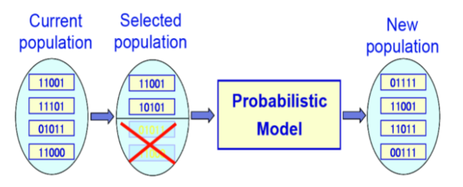

# Estimation of Distribution Algorithms (EDAs)

EDAs are a relatively new branch of evolutionary algorithms that abandon the use of arbitrary genetic **variation** operators (such as mutation and crossover). Instead, they build a probabilistic model of the selected (good) solutions and generate new individuals by sampling from that model. The intuition (assumption) is that good solutions share hidden patterns that can be exploited.

---

## 1. The EDA Algorithm
  

1. **Initialization:**  
   Generate an initial population $P_0$ of $M$ individuals uniformly at random over the search space.

2. **Iteration (for generations $\ell = 1, 2, \dots$):**  
   - **Selection:**  
     Choose $N \leq M$ individuals from $P_{\ell-1}$ using a fitness-based selection method.
   - **Model Estimation:**  
     Estimate the probability distribution $p_\ell(x)$ that describes the likelihood of an individual being among the selected ones.
   - **Sampling:**  
     Sample $M$ new individuals from $p_\ell(x)$ to form the new population $P_\ell$.

This process replaces traditional crossover and mutation with a learning-and-sampling procedure.

---

## 2. Probabilistic Modeling in EDAs

The key idea is to exploit the structure of good solutions by constructing a probabilistic model:

- **For Binary Strings:**  
  A simple model is to use a probability vector $p = (p_1, p_2, \dots, p_n)$ where $p_i$ is the probability that the $i$-th bit is 1.

- **Learning:**  
  $p_i$ is computed as the proportion of 1’s in the $i$-th position among the selected individuals.

- **Sampling:**  
  Each bit $x_i$ is set to 1 with probability $p_i$ and 0 with probability $1-p_i$.

---

## 3. Univariate Marginal Distribution Algorithm (UMDA)
  

### 3.1. Basic Univariate Distribution Algorithm

- **Assumption:**  
  Each bit is treated independently.
  
- **Probability Model:**  
  For a binary string $x = (x_1, \dots, x_n)$, the joint probability is given by: $\Pr(x) = \prod_{i=1}^{n} p_i^{\,x_i} \,(1-p_i)^{(1-x_i)}$
  
- **UMDA Procedure:**  
  1. **Initialization:**  
     Set $p_0 = \left(\frac{1}{2}, \frac{1}{2}, \dots, \frac{1}{2}\right)$.
     
  2. **Iterate**
     
      1. **Sampling:**  
         At each generation $t$, sample $\lambda$ individuals i.i.d. according to the current probability vector.
      
      2. **Selection:**  
         Sort the sampled individuals by fitness (in descending order) and select the top $\mu$ individuals.
      
      3. **Model Update:**  
         For each bit $i$, update: $p_{t+1,i} = \frac{1}{\mu} \sum_{j=1}^{\mu} y^{(j)}_i,$
         where $y^{(j)}_i$ is the $i$-th bit of the $j$-th best individual.

---

### 3.2. Univariate **Marginal** Distribution Algorithm

- **Problem:**  
  Without restrictions, some $p_i$ may reach 0 or 1 (Always zero or one bits), eliminating diversity.

- **Solution:**  
  Use margins to cap probabilities within the interval $\left[\frac{1}{n}, 1-\frac{1}{n}\right]$:
  
$$
p_{t+1,i} =
\begin{cases}
  \frac{1}{n} & \text{if } X_i = 0, \\
  \frac{X_i}{\mu} & \text{if } 1 \leq X_i \leq \mu-1, \\
  1 - \frac{1}{n} & \text{if } X_i = \mu,
\end{cases}
$$
  
Where $X_i = \sum_{j=1}^{\mu} y^{(j)}_i.$
>This ensures continued exploration.

---

## 4. Differenet EDA Approaches

### 4.1. Alternative Models

- **Independent Variables:**  
  Simple models include:
  - **UMDA**
  - **Population Based Incremental Learning (PBIL)**
  - **Compact Genetic Algorithm (CGA)**
  
- **Bivariate or Multiple Dependencies** 

- **Discrete EDAs:**  
  Rely on discrete distributions (like the Bernoulli).
  
- **Continuous EDAs:**  
  Use continuous distributions (e.g., Gaussian) to model variables in continuous optimization problems. This approach is particularly useful when the search space is not binary.

---

## 7. Conclusions

- **Summary:**  
  EDAs form a new class of evolutionary algorithms that forgo traditional genetic operators in favor of estimating and sampling from a probability distribution built on selected individuals.
  
- **Benefits:**  
  - Can potentially outperform conventional evolutionary algorithms when the probabilistic model accurately reflects the problem’s structure.
  - Provide a sequence of models that give insight into hidden patterns of good solutions.
  
- **Key Challenge:**  
  The success of an EDA depends on correctly capturing dependencies in the solution space—especially for complex problems where the i.i.d. assumption (as used in simple probability vectors) may fail.
