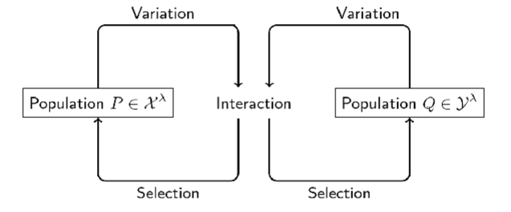
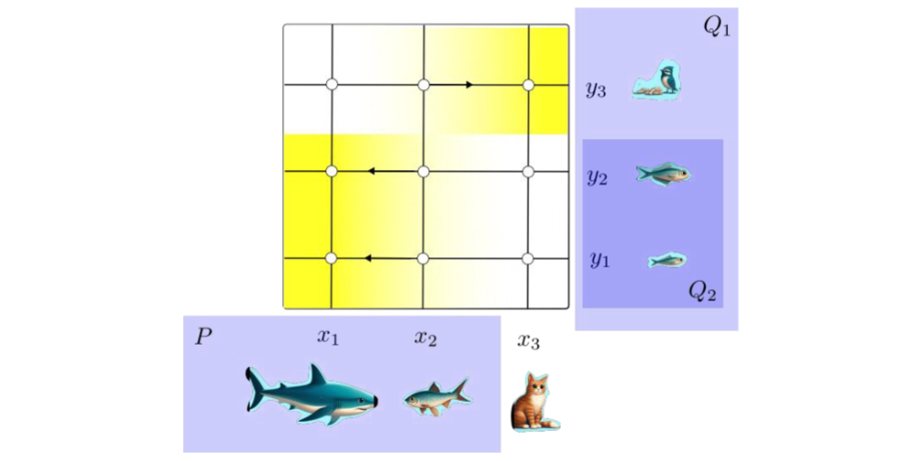
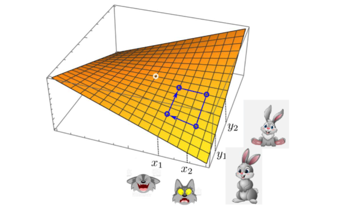
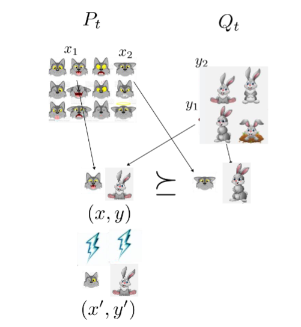

# Co‑Evolution

## 1. Introduction to Co‑Evolution


**Co‑evolution** simply means *learning while competing*.  
Two (or more) populations repeatedly adapt **against** each other, each one’s progress
altering the fitness landscape of the other.

### 1.1 Co‑Evolution in Nature
Classical examples:
- **Predator–prey arms races** (e.g.\ cheetahs vs.\ gazelles).  
  Faster gazelles push cheetahs to become faster, which in turn pushes gazelles again – a feedback loop called the *Red‑Queen effect*.
- **Plant–herbivore chemical warfare** – plants evolve toxins, insects evolve detoxification enzymes, and so on.

**Take‑away:** fitness is *relative*, not absolute.

### 1.2 Traditional vs. Adversarial Optimisation
Traditional optimisation assumes a **static** objective function $f(x)$.  
Adversarial optimisation replaces that with a **game**:      

$$
\text{Predator wants } \max_{x}\; f(x,y), \qquad
\text{Prey wants } \min_{y}\; f(x,y).
$$

The solution concept is usually a **max‑min** (saddle) point.

---

### 1.3 Worked Example – Bilinear Pay‑off


Let $A\in\mathbb{R}^{n\times n}$ and define $f(x,y)=x^\top A y$ with $x,y\in\{-1,1\}^n$.  
**Players:**  
- **Predator** chooses `x`.  
- **Prey**, seeing `x`, chooses `y`.  

**Payoff:**  

$$
f(x,y) = x \cdot y
$$

- Predator wants to **maximize** $f$.  
- Prey wants to **minimize** $f$.


#### 1. Payoff Table
 
| $x \backslash y$ | $-1$                   | $0$                  | $+1$                   |
|:-----------------:|:----------------------:|:--------------------:|:----------------------:|
| **$-1$**          | $(-1)\times(-1)=+1$    | $(-1)\times0=0$      | $(-1)\times1=-1$      |
| **$0$**           | $0\times(-1)=0$        | $0\times0=0$         | $0\times1=0$          |
| **$+1$**          | $1\times(-1)=-1$       | $1\times0=0$         | $1\times1=+1$         |

#### 2. Worst-Case for Predator

The prey reacts **after** seeing $x$ and picks the $y$ that **minimizes** $f(x,y)$. Compute the row-minimum for each $x$:

| $x$    | Row entries         | Row-min (worst payoff) |
|:------:|:-------------------:|:----------------------:|
| **$-1$** | $\{+1,\,0,\,-1\}$  | $-1$                   |
| **$0$**  | $\{0,\,0,\,0\}$    | $0$                    |
| **$+1$** | $\{-1,\,0,\,+1\}$  | $-1$                   |


#### 3. Predator’s Max–Min Decision

The predator chooses the $x$ whose row-minimum is **largest**:

$$
\max_{x\in\{-1,\,0,\,1\}}\;\min_{y\in\{-1,\,0,\,1\}} f(x,y)
= \max\{\,-1,\;0,\;-1\} = 0.
$$

- **Optimal choice:** `x = 0`.  
- Guarantees payoff **≥ 0** regardless of the prey’s response.

---

### 1.3 Evolutionary vs. Co‑Evolutionary Algorithms


| Classic EA | Co‑EA |
|------------|-------|
| One population | Two or more interacting populations |
| Absolute fitness $f(x)$ | Relative or competitive fitness `f(x, opponent)` |
| Objective fixed | Objective shifts as opponents adapt |
| Converges to optimum | Aims for equilibrium (e.g.\ Nash, max‑min) |

Key design question: **how do we measure who is “better”** when “better” itself is moving?

---

## 2. Case Study 1 – Co‑Evolution of Sorting Networks

### What is a Sorting Network?
A **sorting network** is a hard‑wired sequence of compare‑exchange operations.
Think of $n$ *wires* carrying the items; a *comparator* swaps the items on two wires if they are out of order.
The same network must work for *every* input permutation.

**Design criteria**
1. **Correctness:** outputs are always sorted.
2. **Cost:** minimal number of comparators.

For $n=16$ the long‑standing record was **60 comparators** (Green, 1969).

### 2.1 The First GA Attempt (Hillies, 1980s)
- **Encoding:** chromosome lists the pairs of wires to compare.
- **Evaluation:** run the network on a *sample* of test inputs, count how many end up sorted.
- **Result:** rediscovered a 65‑comparator design – respectable, but not an improvement.

> **Why it stalled:** the set of test cases was *static*. Once an individual handled those,
> selection pressure vanished.

### 2.2 The Co‑Evolution Fix
Evolve **two** populations:
1. **Networks** – try to sort.
2. **Test cases** – try to *break* networks.

The game is predator/prey:
- Predator = test case (makes life hard).
- Prey = network (tries to survive all attacks).

As networks improve, tests discover new tricky permutations, restoring pressure.

**Outcome:** a **61‑comparator** network – nearly state‑of‑the‑art and generated automatically.

#### Illustration
```
Population_Networks  --> sorted? --> Fitness_N
Population_Tests     <-- fail?  <-- Fitness_T
```
Every generation both sides mutate; *Hall‑of‑Fame* archives keep the historically
toughest tests so networks cannot forget old weaknesses.

---

## 3. Case Study 2 – Automatic Software Patching

### 3.1 Problem Setup
Given:
- A **buggy program** $P$ (source code).
- A **formal specification** $\varphi$ (pre‑ and post‑conditions).

Goal: evolve a fixed program $\hat P$ that satisfies *all* unit tests implied by φ.

### 3.2 Why Co‑Evolution?
- Programs can exploit loopholes in *specific* tests (overfitting).  
- Adding more tests naively is human‑intensive.

Solution: co‑evolve
1. **Programs** (prey) – minimise fitness = number of failed tests.
2. **Unit tests** (predators) – maximise the same number.

A *Hall‑of‑Fame* of killer tests is kept so programs never relax.

### 3.3 Distance‑to‑Spec Fitness (Arcuri & Yao 2009)
Each program is scored by a distance metric $d(P,\varphi)$ that smoothly penalises partial failures,
guiding search even before a program fully passes or fails a test.

### 3.3 Bubble‑Sort Experiment
- Injected synthetic bugs (e.g.\ off‑by‑one loop bounds) into Bubble Sort.
- Co‑EA successfully recovered correct versions in **most** runs, while a standard EA did not.

> **Practical tips:**  
> – Re‑insert the original buggy program periodically: it contains useful building blocks.  
> – Penalise *too short* programs: trivial solutions like `return 0;` might pass tiny test suites but are useless.

---

## 4. Theoretical Guarantees for Co‑EAs

### 4.1 Incremental Pareto Co-Evolution Archive (IPCA)


**Idea:**  
Maintain two growing archives—one of **predators** $P_t$ and one of **prey** $Q_t$—such that each archive only ever collects **non-dominated** individuals under a bilinear payoff  

$$
g(x,y): \mathcal X \times \mathcal Y \to \mathbb R.
$$


#### 4.1.1 Dominance definition  
- A predator $x$ **Pareto-dominates** $x'$ (written $x \succeq_Q x'$) if  
  1. $g(x,y)\ge g(x',y)$ for **all** $y\in Q$, and  
  2. Strict inequality holds for **at least one** $y\in Q$.  

- Likewise, prey $y$ dominates $y'$ (written $y \preceq_P y'$) if it makes **all** predators do no better and at least one strictly worse.


#### 4.1.2 “Useful” definitions  
- **Useful prey** $y\in Q'$ is one whose addition to the prey archive **invalidates** the dominance of at least one **new** predator $x\in P'$. Formally, there exists $x\in P'$ such that

$$
  x \succeq_{Q_t} x \quad\text{but}\quad 
  \neg\bigl(x \succeq_{Q_t\cup\{y\}} x\bigr).
$$

  We keep $y$ only if it sharpens our evaluation of predators.  

- **Useful predator** $x\in P'$ is one not already dominated by the existing predator archive against the updated prey set $Q_{t+1}$. In symbols:
  
$$
  \nexists\,x_{\rm old}\in P_{t+1}\ \text{s.t.}\ 
  x_{\rm old}\succeq_{Q_{t+1}} x.
$$

  We keep $x$ only if it expands the Pareto front of predators.


#### 4.1.3 Pseudocode walkthrough

```text
Require: payoff g : X × Y → ℝ
1.  P₀ := ∅,  Q₀ := ∅,  t := 0
2.  while not done:
3.    Pₜ := { x∈Pₜ | no xₚ∈Pₜ dominates x }     ← prune dominated predators
4.    Pₜ₊₁ := Pₜ
5.    Qₜ₊₁ := Qₜ
6.    P' := generatePredators(Pₜ)            ← mutate/crossover
7.    Q' := generatePrey(Qₜ)                 ← mutate/crossover
8.    for each y ∈ Q':
9.      if ∃ x ∈ P' that breaks dominance under Qₜ:
10.       Qₜ₊₁ := Qₜ₊₁ ∪ {y}                  ← add useful prey
11.   end for
12.   for each x ∈ P':
13.     if x not dominated by Pₜ₊₁ under Qₜ₊₁:
14.       Pₜ₊₁ := Pₜ₊₁ ∪ {x}                  ← add useful predators
15.   end for
16.   if Pₜ₊₁ ≠ Pₜ:
17.     t := t + 1
18.   end if
19. end while
```


#### 4.1.4 Monotonic progress

1. **Prey archive**
   
$$
 Q₀ \subseteq Q₁ \subseteq \cdots \subseteq Q_t \subseteq Q_{t+1}
$$

> – We *never remove* prey; once a challenging test problem enters $Q_t$, it remains.

2. **Predator archive** only loses an $x$ if a strictly **better** predator appears later:
   
$$
 x\in P_t,\ x\notin P_{t+1}
 \implies \exists\,x'\in P_{t+1}:\ x' \succeq_{Q_{t+1}} x.
$$

> By induction on $t$, the archives $(P_t, Q_t)$ can **only** expand or get strictly stronger—**the Pareto front never retreats**, guaranteeing monotonic improvement.

---

### 4.2 Pairwise Dominance Co-Evolutionary Algorithm (PDCoEA)


#### 4.2.1 Core idea  
Replace the expensive Pareto-archive bookkeeping of IPCA with simple **head-to-head tournaments**:

1. **Maintain** two populations of size $\lambda$: predators $P_t$ and prey $Q_t$.  
2. **In each generation**, for $i = 1 \dots \lambda$:  
   - Sample two candidate pairs $(x_1,y_1), (x_2,y_2)\sim \mathrm{Unif}(P_t\times Q_t)$.  
   - Compare payoffs under $g$:
     
$$
 (x_1,y_1)\succeq_g(x_2,y_2)
 \quad\Longleftrightarrow\quad
 g(x_1,y_2)\ge g(x_1,y_1)\ge g(x_2,y_1).
$$

 - **Keep** the winner $(x,y)$, **mutate** each bit in $x,y$ independently with probability $\chi/n$, and set them into $P_{t+1}(i), Q_{t+1}(i)$.
   



#### 4.2.2 Theoretical guarantees
- **Population size**: $\lambda=\Omega(\log n)$.  
- **“Safe” mutation**: $\chi < c_0 < \ln 2$.  
  - Then on some bilinear games
    
$$
  \Pr\bigl(T > \Theta(n\,\lambda^3)\bigr) < \frac1r
  \quad\text{for all }r>0,
$$
  
  so the **expected** time to optimum is $\Theta(n\lambda^3)$.  
- **Too much mutation**: if $\chi > \ln 2$, finishing by time $e^{c n}$ becomes **exponentially unlikely**:

$$
  \Pr\bigl(T < e^{c n}\bigr) = e^{-\Omega(n)}.
$$


#### 4.2.3 Practical trade-offs
- **No monotonicity**: unlike IPCA’s ever-growing Pareto fronts, PDCoEA can **lose** high-quality predators or prey.  
- **High “drift”**: average progress per generation is positive, so it often **converges faster** in practice—provided you **tune** $\lambda$ and $\chi$ correctly.  


> **Bottom line:** PDCoEA trades the guaranteed, non-retreating Pareto archive of IPCA for a light-weight tournament scheme that—when mutation is modest—yields strong runtime bounds, at the cost of occasional back-sliding.  
