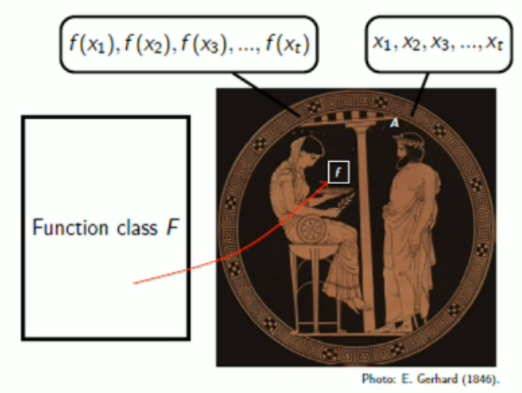

# The No Free Lunch Theorem

## 1.  Black‑Box Optimisation Algorithms


### 1.1 Problem setting

- **Search space**:  
  A finite set $X$ of candidate solutions (for example, all bit-strings of length $n$).

- **Objective function**:  
  $$f : X \;\to\; \mathbb{R},$$  
  where we assume **maximisation**.  Our goal is to find  
  $$x^* \;=\;\arg\max_{x\in X} f(x),$$  
  i.e. the solution with the highest score.

- **Black-box queries**:  
  The optimiser can pick any $x\in X$, ask for $f(x)$, and receive back the scalar value.  
  - **No additional information** (no gradients, no structure).  
  - Each query is expensive, so we count how many are needed.


### 1.2 Measuring runtime

Let $A$ be a black-box algorithm and $f$ an objective function.

1. **Runtime on a single function**  
   Define
   

$$
T_{A,f} := \min\{\,t\in\mathbb{N}\mid f(x_t)\ge f(y)\ \forall\,y\in X\}
$$


   where $x_t$ is the $t$-th point that $A$ queries.  
   - In plain words: **the number of function evaluations** until $A$ first finds a global optimum.

2. **Expected runtime over a function class**  
   Suppose we have a distribution $\Pr[f]$ over a set of functions $\mathcal{F}$.  Then
   
$$
\mathbb{E}\bigl[T_{A,\mathcal{F}}\bigr]
\;=\;\sum_{f\in\mathcal{F}} \Pr[f]\;\mathbb{E}\bigl[T_{A,f}\bigr].
$$

   - This averages the runtime of $A$ across all problems you might face (or across an adversary’s choice).

### 1.3  General scheme of a black‑box optimiser

```text
1. Choose an initial probability distribution p₀ over X.
2. Sample x₀ ~ p₀; set R₀ = {x₀}.
3. Evaluate f(x₀).
4. For t = 1 … |X|:
       a. History H_t = ((x₀,f(x₀)), … , (x_{t-1},f(x_{t-1}))).
       b. Choose new distribution p_t on X \ R_{t-1} (may depend on H_t).
       c. Sample x_t ~ p_t; update R_t = R_{t-1} ∪ {x_t}.
       d. Evaluate f(x_t).
```

#### Why this matters

- **Black-box**: you treat $f$ as an oracle—no shortcuts from derivatives or problem structure.  
- **Runtime**: instead of “time” on a CPU, we count **evaluations** of $f$, which often dominate the cost (e.g.\ expensive simulations, lab experiments).  
- **Expected analysis**: gives a fair comparison when facing many possible functions or worst-case/adversarial scenarios.

Use these definitions to compare strategies like random search, evolutionary algorithms, and more sophisticated heuristics in a principled way.

---

## 2.  The No Free Lunch Theorem


### 2.1  Informal meaning

> *Averaged across *all* possible functions, every optimiser performs equally well.*  
> If you refuse to assume structure in your objective, **there is no universally superior algorithm**.

### 2.2  Formal statement (Wolpert & Macready 1997)

Let $X$ and $Y\subseteq\mathbb{R}$ be finite.  Let $\mathcal{F}$ be **any** set of functions $f:X\to Y$ that is **closed under permutation** (defined below).  Then for **any** two black‑box optimisation algorithms A and B,

$$\mathbb{E}\bigl[T_{A,\mathcal{F}}\bigr] \;=\; \mathbb{E}\bigl[T_{B,\mathcal{F}}\bigr].$$

In other words, **average runtime depends only on the function class, never on the algorithm**.


### 2.3 Key definition — *Closed Under Permutation* (c.u.p.)

**Definition:**  
A function class $\mathcal{F}$ over a finite domain $X$ is **closed under permutation** if, for **every**  

$$
f \in \mathcal{F}
\quad\text{and every permutation}\quad
\sigma: X \twoheadrightarrow X,
$$

the *relabelled* function  

$$
f \circ \sigma : X \;\longrightarrow\; \mathbb{R}
$$  

also belongs to $\mathcal{F}$.

> In other words, if you shuffle (“permute”) the input labels, you stay inside the class.


#### Intuition  
- A permutation $\sigma$ simply reassigns which element of $X$ is “first,” “second,” etc.  
- **C.u.p.** means the class has **no built-in bias** about where good solutions lie: any relabelling of a valid landscape is still valid.


#### Worked micro-example ($|X| = 3$)

Let $X = \{\bullet, \blacksquare, \triangle\}$ and define

| $x$           | $\bullet$ | $\blacksquare$ | $\triangle$ |
|:-------------:|:---------:|:--------------:|:-----------:|
| **$f_1(x)$**  | $1$       | $2$            | $3$         |
| **$f_2(x)$**  | $2$       | $3$            | $1$         |
| **$f_3(x)$**  | $3$       | $1$            | $2$         |

- The set $\{f_1,f_2,f_3\}$ is **not** c.u.p. (it’s missing half the permutations).  
- A fully c.u.p. family on these three points must contain **all 6** relabellings of $\{1,2,3\}$ over $\{\bullet,\blacksquare,\triangle\}$ (call the additional ones $f_4,f_5,f_6$).

Thus the smallest c.u.p. class here is  

$$
\{\,f_1,f_2,f_3,f_4,f_5,f_6\},
$$

covering every possible “reshuffle” of the scores.


#### Why it matters (No Free Lunch)  
If $\mathcal{F}$ is c.u.p., **no** black-box optimiser can outperform random search **on average** over $\mathcal{F}$. Any strategy that exploits a pattern in one $f$ is undone by some permuted copy $f\circ\sigma$. This is the essence of the **No Free Lunch** theorem.

---

### 2.4  Proof sketch of NFL

The proof proceeds in two layers:

1. **Deterministic algorithms** — by induction on $|X|$.  
   * Base case $|X|=1$ is trivial.  
   * Inductive step partitions $\mathcal{F}$ according to the first point queried and the value returned, then applies the hypothesis because each partition is itself c.u.p.

2. **Randomised algorithms** — any randomised method is a probability distribution over finitely many deterministic ones.  Linearity of expectation carries the result across.

Full algebraic details are in the original paper; see the *Step‑by‑Step Proof* section below for an annotated walkthrough. 


### 2.5  Consequences

* **No universal best heuristic.**  Optimiser rankings can flip when you change the problem distribution.  
* **Assumptions are unavoidable.**  To justify why, say, CMA‑ES beats Genetic Algorithms on your workload you *must* articulate structural properties *not* captured by c.u.p.—for example, smoothness, separability, or low‑effective dimensionality.

---

## 3.  Step‑by‑Step Proof (annotated)

Below we expand the induction argument in plain language.

### 3.1  Induction hypothesis  

Assume the theorem holds for all search spaces of size N.

### 3.2  Inductive step: space size $N+1$

Let $A$ pick $x$ first; let $B$ pick $y$ first (possibly $x=y$).

1. **Condition on the first feedback.**  
   After $A$ sees $f(x)=b$ the remaining uncertainty is the restricted class
   
$$
\mathcal{F}(x,b) := \{\,f\in\mathcal{F}\mid f(x)=b\}.
$$

   By permutation closure, $\mathcal{F}(x,b)$ is c.u.p. over the *reduced* search space $X\setminus\{x\}$.  The same holds for $\mathcal{F}(y,b)$.

2. **Isomorphism.**  
   There exists a bijection mapping $\mathcal{F}(x,b)$ onto $\mathcal{F}(y,b)$, implying the two subproblems are *identical up to relabelling*.  

3. **Apply induction.**  
   Because the reduced space has size N, the expectation of continuing runtime is the same for any algorithm.  

4. **Re‑assemble expectations.**  
   Break the total expectation into the event " $x$ is already optimal " (probability $p$) plus the residual expectation given $f(x)=b$ for $b \ne \text{optimal value}$.  Symmetry in all pieces yields  
   $$\mathbb{E}[T_{A,\mathcal{F}}] = \mathbb{E}[T_{B,\mathcal{F}}].$$

5. **Randomised algorithms.**  
   If $A$ tosses coins to choose among deterministics $A_1,\dots,A_m$ then linearity gives  
   $$\mathbb{E}[T_{A,\mathcal{F}}] = \sum_i \Pr[A\text{ chooses }A_i] \; \mathbb{E}[T_{A_i,\mathcal{F}}] = \mathbb{E}[T_{\mathcal{F}}].$$

Hence the theorem holds for size $N{+}1$, completing induction.

---

## 4. How realistic is the NFL scenario?

### 4.1 Counting argument: why “random” functions are impossible

- **Search space size**  
  $X = \{0,1\}^{100}$ has $|X| = 2^{100}$ points.
- **Output space size**  
  $Y = \{0,\dots,2^{32}-1\}$ has $|Y| = 2^{32}$ possible values.
- **Number of distinct functions**  

$$
  \bigl|\mathcal F\bigr|
  = |Y|^{|X|}
  = (2^{32})^{2^{100}}
  = 2^{32\cdot 2^{100}}.
$$

- **Information‐theoretic lower bound**  
  To specify an arbitrary function in this huge set you need at least

$$
  32\cdot 2^{100} - 1
$$

  bits of code—on the order of $10^{20}$ terabytes!

> **Take-away:** Treating the objective as a truly random mapping is completely unrealistic. Real-world objective functions come from physics, biology, economics, etc.—they have structure and compressibility.

---

### 4.2 Almost No Free Lunch (Droste et al., 2002)

Even if you restrict yourself to functions “close” to a nice $f$, there exist subtle adversarial tweaks that foil any fixed optimiser:

1. **Start with any**  

$$
  f: \{0,1\}^n \to \{0,1,\dots,N-1\}.
$$

2. **Construct “trap” variants**  
   There are at least

$$
  N\,2^{\,n/3 - 1}
$$

functions $f^*$ which  
   - **Differ** from $f$ on only $\le 2^{n/3}$ inputs, yet  
   - **Defeat** algorithm $A$: with probability $\ge 1 - 2^{-n/3}$, $A$ will **not** find the maximum in the first $2^{n/3}$ queries.
3. **Compact traps**  
   These $f^*$ only add $O(n)$ bits of description beyond the original $f$.

> **Practical moral:**  
> - **Use domain knowledge** to narrow the search class to realistic functions.  
> - **Build robustness**: choose algorithms whose performance degrades gracefully if the problem deviates from your assumptions.

---

## 5.  Practical implications

* **Algorithm selection must be context‑dependent.**  
  Profile representative benchmarks or leverage theoretical insight about your landscape.

* **Hybrid / adaptive schemes** can bypass NFL by *changing behaviour* on‑the‑fly, effectively conditioning on observed structure.

* **Explain your assumptions.**  When publishing results, specify which landscape features (e.g. smoothness, locality, decomposability) underpin the performance claims.
