# Nature of Data: Basis and Coordinate Systems

---

## 1. Basis and Coordinate Systems


### 1.1 What is a Basis?
A **basis** is a set of functions or vectors that allows every element of a vector space to be expressed **uniquely** as a linear combination of those basis elements. For example:

`v = Σ (ωᵢ * eᵢ)`

- `v`: An element in the vector space  
- `eᵢ`: Basis functions or vectors  
- `ωᵢ`: Coordinates (weights) in that basis  

**Dimension** is the number of basis functions.

> **Key Concept**  
> Every point in the space can be uniquely represented using a chosen basis, and the tuple `(ω₁, ω₂, …, ωₙ)` defines the coordinates of that point.

---

### 1.2 Examples of Coordinate Systems

#### 1.2.1 Canonical Basis in Euclidean Space
- For 2D space, `ℝ²`, the canonical basis is:  
  `{ (1, 0), (0, 1) }`
  
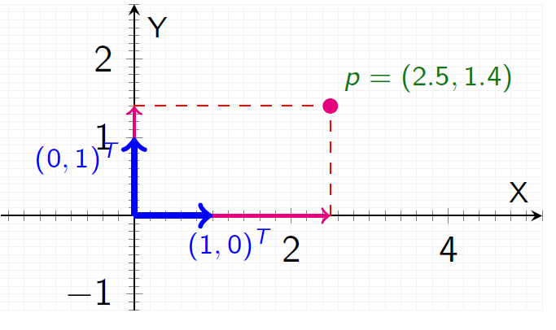

- **Example**: Represent the point `p = (2.5, 1.4)` as  
  `p = 2.5 * (1, 0) + 1.4 * (0, 1)`


#### 1.2.2 Argand Basis in Complex Plane
- Complex numbers:  
  `{ 1, i }`


- **Example**: `z = 1.8 + 3.2i` can be written as  
  `z = 1.8 * 1 + 3.2 * i`

#### 1.2.3 Orthogonal Unit Vectors in Physics
- In 3D Cartesian coordinates:  
  `{ î, ĵ, k̂ }`

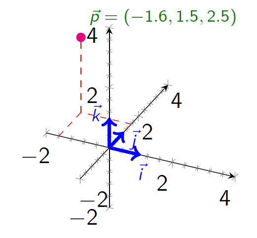

- **Example**: `p = -1.6 î + 1.5 ĵ + 2.5 k̂`

> **Insight**  
> Coordinate systems allow us to represent elements uniquely, and the choice of basis can vary depending on the context or application.

---

### 1.3 Representing Signals, Their Dimension, and Coordinate Bases

#### 1.3.1 A Simple Set of Signals (Dimension 2)
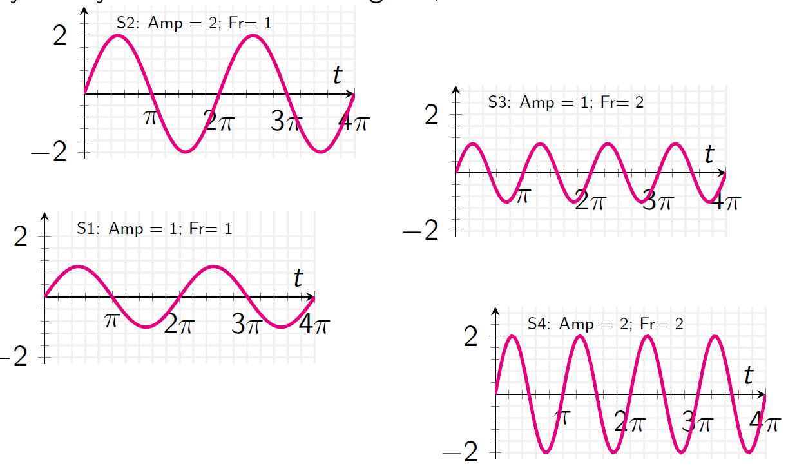  

We have four signals: `S_1, S_2, S_3, S_4`. Each is completely described by **amplitude (A)** and **frequency (F)**:
- **Amplitude** \((A)\) – how tall the wave is.
- **Frequency** \((F)\) – how often it oscillates per unit time.

In table form:

| Signal | Amplitude (A) | Frequency (F) |
|--------|---------------|---------------|
| `S_1`  | 1             | 1             |
| `S_2`  | 2             | 1             |
| `S_3`  | 1             | 2             |
| `S_4`  | 2             | 2             |

These two descriptors suffice to distinguish the signals, so the set has **dimension = 2**. If you tried using only amplitude or only frequency, you wouldn’t be able to differentiate them all.

---

#### 1.3.2 Visualizing the Signals

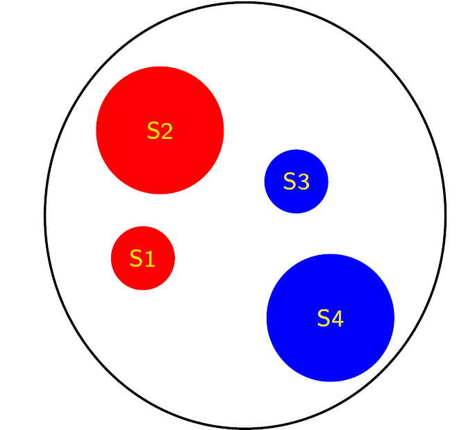  

- **As circles:**  
  - Color could represent frequency (red = 1 Hz, blue = 2 Hz).  
  - Circle size could represent amplitude (1× or 2×).  
  - Example: `S_2` is a **large red** circle (`A=2, F=1`).
  
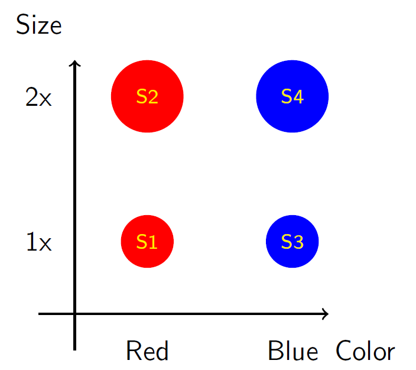  


#### 1.3.3 Ordering and Scaling Descriptors

We could swap the order to `(F, A)` or scale them (e.g., halve frequency, double amplitude). The actual numeric pairs change, but each signal remains unique. This preserves the fact that **2** descriptors are still enough to cover all signals.


---

#### 1.3.4 Coordinate Bases in Linear Algebra Terms
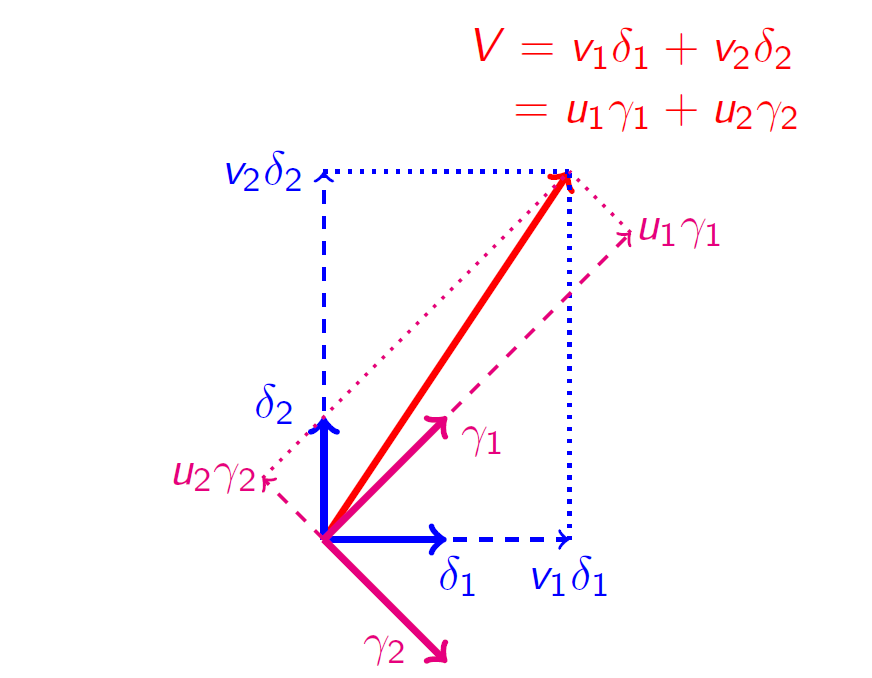  

A 2D vector `V` can be written in one basis `{δ₁, δ₂}` as:

```
V = v₁ δ₁ + v₂ δ₂
```

or in another basis `{γ₁, γ₂}` as:


```
V = u₁ γ₁ + u₂ γ₂
```

The pairs `(v₁, v₂)` and `(u₁, u₂)` differ, but they describe the **same** vector `V`. Similarly, our signals can have different descriptor pairs under different conventions—yet still be the same underlying signal.

---

#### 1.3.5 Big Picture

- **Dimension = 2**: We need two independent descriptors (like amplitude, frequency).  
- **Ordering & Scaling**: We can reorder or rescale these descriptors without losing uniqueness.  
- **Multiple Bases**: The same signal can have many different coordinate representations in different bases. The signal itself remains the same; only the coordinate labels change.


> **In short**   
> Describing signals with amplitude–frequency pairs is a convenient **2D representation**; the fundamental principle is that any valid choice of basis/descriptor set will preserve uniqueness and identify them all.

---

## 2. Decompositions in Data Analysis
Decompositions provide methods to express data in terms of **new basis functions** that simplify processing or analysis.


### 2.1 General Linear Model (GLM)

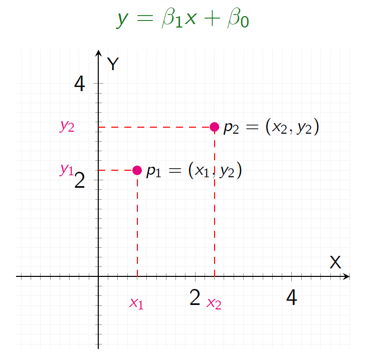

The **General Linear Model (GLM)** is a foundational mathematical framework that expresses relationships between variables. It is recognized as one of the most pervasive and powerful models in science due to its simplicity, elegance, and capability to express linear relationships across various disciplines, including natural and social sciences.

#### **Basic Representation**
A GLM defines the relationship between a dependent variable `y` and one or more independent variables `xᵢ` as:

```text
y = β₀ + β₁x + ε
```
- `β₀`: Intercept term (y-intercept of the line).
- `β₁`: Slope coefficient.
- `x`: Predictor (independent variable).
- `ε`: Error term (captures randomness or deviation from the model).

---

#### **Solving GLM for Two Points**
Given two data points `(x₁, y₁)` and `(x₂, y₂)`, we determine the slope (`β₁`) and intercept (`β₀`) using:

```text
β₁ = (y₂ - y₁) / (x₂ - x₁)
β₀ = y₁ - β₁ * x₁
```

**Example**:
- Points: `(x₁, y₁) = (0.8, 2.2)` and `(x₂, y₂) = (2.4, 3.1)`
- Slope:
  ```text
  β₁ = (3.1 - 2.2) / (2.4 - 0.8) = 0.5625
  ```
- Intercept:
  ```text
  β₀ = 3.1 - (0.5625 * 2.4) = 1.75
  ```

Thus, the line equation becomes `y = 0.5625x + 1.75`.

---

#### **Handling Multiple Points**
1. **Collinear Points**  
   If all points lie perfectly on a straight line, the same process applies. The resulting equation accommodates all points without error.

2. **Non-Collinear Points**  
   For points that do not align perfectly, we introduce an error term `ε` to capture the deviation:
   ```text
   y = β₀ + β₁x + ε
   ```
   The solution then involves minimizing the sum of squared errors (`ε²`) using methods like **least squares regression**.

**Example**:  
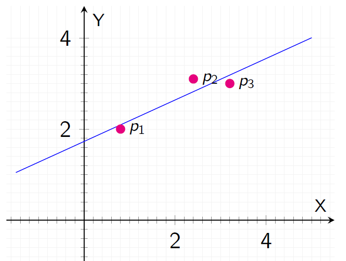

For three points `(p₁, p₂, p₃)` where the line is imperfectly fitted:
```text
y = 0.45536x + 1.7286 + ε
```

---

#### **Multivariate GLM**
GLM extends to multiple predictors, generalizing as:
```text
y = β₀ + ∑(βᵢ * xᵢ)
```

In matrix notation:
```text
Y = Xβ + ε
```
Where:
- `Y`: Vector of observed values.
- `X`: Design matrix (predictors).
- `β`: Vector of coefficients.
- `ε`: Error vector.

The coefficients are determined by:
```text
β = (XᵀX)⁻¹XᵀY
```

---

#### **Geometric Interpretation**
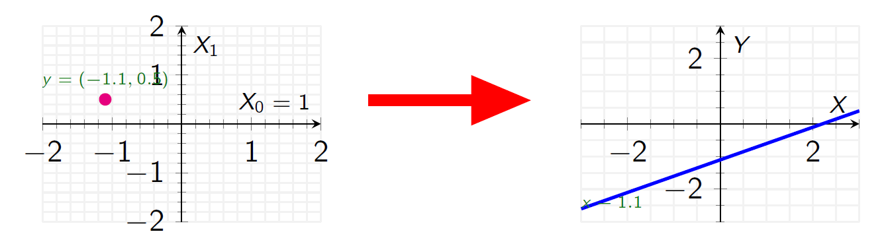

The GLM `y = β₀ + β₁x` can be visualized geometrically:
1. As a line in the Cartesian plane (e.g., `(X, Y)` view).
2. As a **point in the space of all lines**, where the coefficients `β₀` and `β₁` represent the "coordinates" of the line in this abstract space.

**Example**:  
The line `y = 0.45536x + 1.7286` corresponds to the point `(1.7286, 0.45536)` in the space of lines.

---

#### **Key Insights**
- **Versatility**: GLM can express virtually any linear relationship and serves as the backbone for linear regression analysis.
- **Connection to Data Analysis**: Changing the coefficients (`β₀`, `β₁`, etc.) corresponds to shifting the point in the space of models, enabling various data processing and analytical tasks.
- **Limitations**: While powerful, GLM assumes linearity and certain noise characteristics (e.g., spherical noise).

> "Relocating your point in the space corresponds to a processing operation." This encapsulates the essence of data transformations and analysis within the GLM framework.


---

### 2.2 Fourier Analysis


**Definition**  
Fourier analysis decomposes a signal in the time domain `f(t)` into its component frequencies, expressed as:
```text
f(t) = Σ [aₙ cos(nωt) + bₙ sin(nωt)]
```
Alternatively, it can be represented using complex exponentials:
```text
f(t) = Σ cₙ * e^(jωt)
```
The two forms are related by Euler’s formula:  
```text
e^(jϕ) = cos(ϕ) + j sin(ϕ)
```

#### **Key Concepts**
- Fourier analysis is essentially a change of basis into a space defined by sinusoidal functions or complex exponentials.  
- It represents any periodic signal as a weighted sum of sinusoidal functions.

#### **Applications**
- **Filtering**: Retain or remove certain frequencies for signal processing.
- **Signal Reconstruction**: Recreate original signals from their frequency components.
- **Spectral Analysis**: Understand and analyze signal behavior in the frequency domain.

---

#### **Example**
Consider the signal:
```text
f(t) = sin(2πt) + (1/3) sin(6πt)
```
- **Frequency Components**:  
  - First component: Amplitude `1`, Frequency `2π`  
  - Second component: Amplitude `1/3`, Frequency `6π`

- This can be visualized both as a signal over time (`f(t)`) and as a point in the space of signals, with coordinates `(1, 1/3)`.
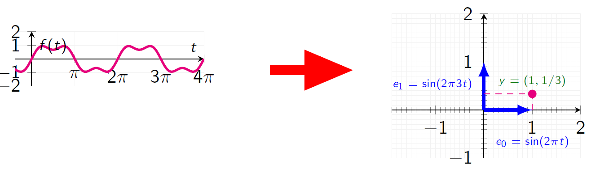

**Low-Pass Filtering**:  
To apply a low-pass filter, we set the higher frequency component to `0`:
```text
Filtered signal: ŷ = (1, 0)
```
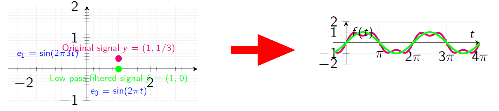  
Reconstructing gives a smoothed signal with only the low-frequency component.


---


### 2.3 Wavelet Transform
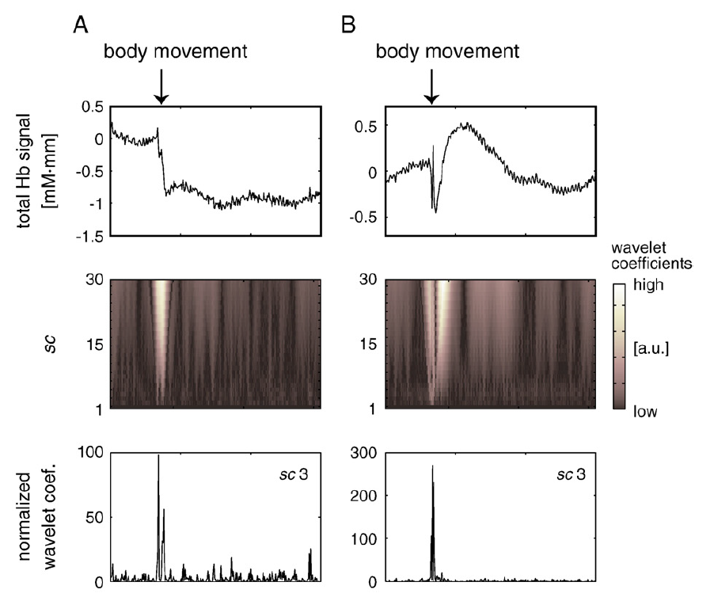  

**Definition**  
The Wavelet Transform represents signals using scaled and translated "wavelets," which are localized, oscillatory functions. It can be expressed as:
```text
f(t) = Σ c₍k,n₎ Ψ(t; k, n)
```
Where:
- `Ψ(t; k, n)`: Scaled and translated versions of a "mother wavelet".
- `c₍k,n₎`: Wavelet coefficients, calculated as:
  ```text
  c₍k,n₎ = ∫ f(t) Ψ*(t; k, n) dt
  ```

#### **Key Concepts**
- **Wavelets**: Localized oscillations with amplitudes that start at zero, rise, and return to zero.
- The wavelet transform creates a new coordinate system, where scaled and translated wavelets form the basis for the signal space.
- Unlike Fourier analysis, which operates globally, wavelets provide **both spectral and temporal localization**.  
- While the Short-Time Fourier Transform (STFT) improves temporal localization, wavelets offer more **flexible resolution** due to their multi-scale nature.

---

#### **Key Insights**
- **Flexibility**: The large variety of wavelet families allows customization for specific signal types.  
- **Robustness**: Wavelet transforms often produce meaningful results even with minimal tuning.  
- **Applications**: From denoising to compression, wavelets are a go-to tool in signal processing, particularly for spatiotemporal tasks.

---


### 2.4 Principal Component Analysis (PCA)
  

**Definition**  
PCA is a method that rotates the data to align with the directions of **maximum variance**. 

#### **Dimensionality Reduction**
- PCA achieves dimensionality reduction by retaining only the principal components with the largest eigenvalues (those explaining the most variance).  
- Eigenvectors corresponding to smaller eigenvalues (low variance) can be discarded.

#### **Applications**
- **Data Compression**: Reduce dimensionality while preserving most of the variance.  
- **Denoising**: Filter noise by reconstructing data from the significant components.  
- **Data Visualization**: Represent high-dimensional data in 2D or 3D.

#### **Filtering in PCA/cMDS Space**
- **Low-Pass Filter**: Set coefficients of eigenvectors with smaller eigenvalues to `0` and reconstruct.  
- **High-Pass Filter**: Set coefficients of eigenvectors with larger eigenvalues to `0`.  
- **Bandpass/Band-Reject Filter**: Retain or remove coefficients within specific eigenvalue ranges.

> **Geometric Interpretation**  
> PCA and cMDS involve a change of basis, with eigenvectors forming the new coordinate system. Each data point is expressed in terms of these basis vectors.

---

## 3. Manifold Embedding
  

### 3.1 What is a Manifold?

A **manifold** is a mathematical space that is locally Euclidean, meaning it appears flat when viewed in small regions but can have global curvature. Formally, a manifold is defined as:
- A set (Hausdorff space) with a countable base that is homeomorphic to a unit disk.

For practical purposes, the unit disk often refers to the Euclidean space (`Rⁿ`).  

**Example**:  
A sphere is locally flat (on small patches) but globally curved.

---

### 3.2 Manifold Embedding
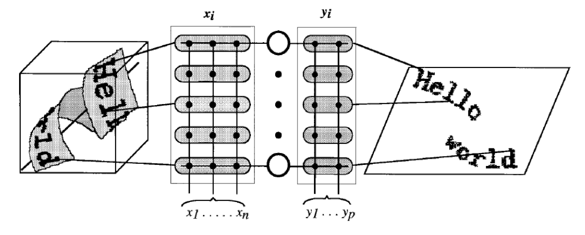  

**Definition**:  
Manifold embedding refers to the projection of one manifold onto another, typically in lower-dimensional space. This is often used for:
- Visualizing data.
- Uncovering underlying patterns in high-dimensional datasets.

---

#### **Geometric Insight**
Manifold embedding inherently involves a change of basis, where:
```text
p = Σ ωᵤ(p)ᵢ eᵤ(p)ᵢ
```
Here, `u(p)` represents a local neighborhood around point `p`, forming a **local coordinate basis** at each point on the manifold.

---

### 3.4 Practical Insights

- **Versatility**: Manifold embedding is highly expressive and generalizes many mathematical tools (e.g., PCA, graph theory).  
- **Powerful Framework**: Although computationally intensive, it can solve problems that other methods cannot.  
- **Recommendation**: Use manifold embedding as a last resort when simpler methods (GLM, PCA, Wavelets) are insufficient.
