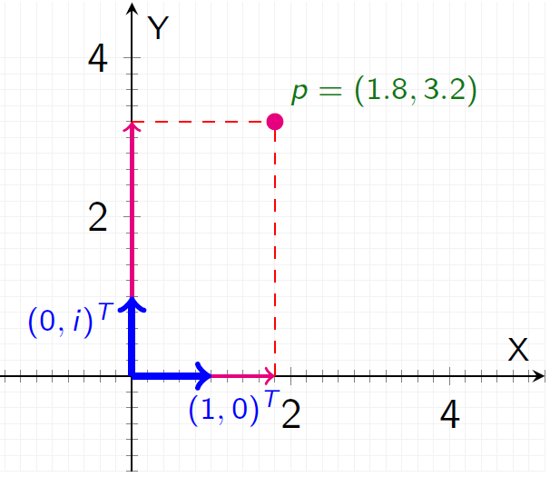
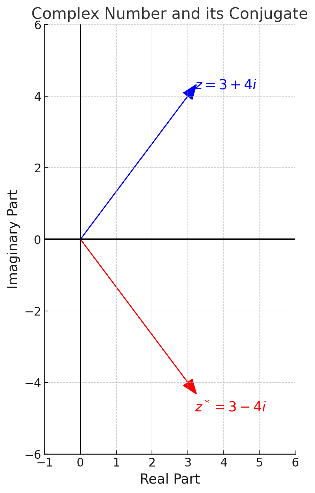
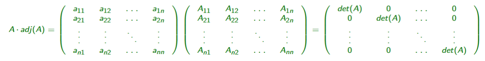
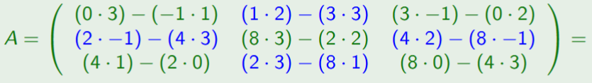

# Dimensional Analysis by Co‑occurrence — *Latent Semantic Analysis*

---

## 1 — Latent Semantic Analysis (Problem Statement)

### 1.1  LSA
Latent Semantic Analysis (LSA) surfaced in 1990 as a technique for **discovering latent concepts hidden in a document‑term co‑occurrence matrix**. At its core, LSA is just a *Singular Value Decomposition* (SVD) applied to the count matrix, so it travels well beyond text — any tall, rectangular data set with meaningful co‑occurrences can ride the same math.

### 1.2  From PCA to LSA — why co‑occurrence beats covariance for text

| | Doc A | Doc B | Doc C |
|---|---|---|---|
| **word: cat** | 2 | 0 | 0 |
| **word: dog** | 1 | 1 | 0 |
| **word: apple** | 0 | 0 | 3 |
| **word: fruit** | 0 | 0 | 2 |

1. **PCA recap**:
   - In PCA, you start with a matrix $\mathbf{X} \in \mathbb{R}^{m \times n}$.
   - Rows = observations (data points)
   - Columns = variables (features)
   - You look at how much variables move together (covariance).
   - You create a covariance matrix $\mathbf{A}= \text{cov}(\mathbf{X})$ is $n\times n$ — it's a square matrix.
   - You do eigendecomposition to find the directions where variance is biggest (principal components).
2. **Problem**:
    - Covariance works great only when the data is clean, centered, and has a single lump (unimodal).
    - In real-world messy data (like text), central tendency isn't good enough.
    - Hard truth: You need another way to understand relationships: co-occurrence.
3. **Solution**: Latent Semantic Analysis
    - Same idea as PCA — matrix $X$ is now an occurrence matrix.
    - Columns = documents
    - Rows = words
    - Each number in the matrix = how often a word appears in a document.

### 1.3  Document–Term Matrix anatomy

| | $d_1$ | $d_2$ | … | $d_n$ |
|---|---|---|---|---|
| **$t_1$** | $x_{11}$ | $x_{12}$ | … | $x_{1n}$ |
| **$t_2$** | $x_{21}$ | $x_{22}$ | … | $x_{2n}$ |
| … | … | … | … | … |
| **$t_m$** | $x_{m1}$ | $x_{m2}$ | … | $x_{mn}$ |

* Columns $d_j$ are **document vectors**.  
* Rows $t_i$ are **term vectors**.  
* Entries $x_{ij}$ are raw counts, TF‑IDF scores, or any weighting scheme.

---

### 1.4  What we already know from the module

#### 1.4.1 Coordinate bases refresher (Argand diagram)

A complex number $p = \omega_1 + \omega_2 i$ can be decomposed in the basis $\{e_1=(1,0)^T,\;e_2=(0,i)^T\}$:

$$p = \omega_1 e_1 + \omega_2 e_2$$

Same idea generalises: choose a basis, express vectors as weighted sums of those basis vectors. LSA will **learn** a new basis that captures semantics.

#### 1.4.2 Eigendecomposition

For a *square*, symmetrical matrix $\mathbf{A}$:

$$ \mathbf{A} = \mathbf{P}\ \mathbf{D}\ \mathbf{P}^{-1} $$

* $\mathbf{P}$ — columns are eigenvectors (basis change).  
* $\mathbf{D}$ — diagonal of eigenvalues (axis scaling).

LSA swaps eigendecomposition for SVD because $\mathbf{X}$ is rectangular. Still, the spirit — rotate to a smart basis then scale — is identical.

---

## 2 — Complex Conjugates & the Conjugate Transpose Matrix

### 2.1  Complex Conjugate — definition & example

A complex number $z = a + b i$, where $a$ = real part, and $b$ = imaginary part, has *conjugate* $z^{\*} = a - b i$.  

> You flip the sign of the imaginary part.

---

### 2.2  Key algebraic properties

* **Product**    
  Multiplying a number by its conjugate yields a non‑negative real number
  $$z\,z^{\*} = (a + b i)(a - b i)=a^2 + b^2$$

* **Distributive**  
  $(z + w)^{\*} = z^{\*} + w^{\*}$,   $(z - w)^{\*} = z^{\*} - w^{\*}$  
  $(z w)^{\*} = z^{\*} w^{\*}$,   $\bigl(\dfrac{{z}}{{w}}\bigr)^{\*} = \dfrac{{z^{\*}}}{{w^{\*}}}$ for $w \ne 0$

* **Modulus unchanged**  
  $|z^{\*}| = |z|$

* **Involutory**  
  $(z^{\*})^{\*} = z$

* **Powers commute**  
  $(z^n)^{\*} = (z^{\*})^n$

---

### 2.3  Why do we care?

There are many reasons why complex conjugates are important, but for our use case they are important for:
* **Undo rotations** in the Argand plane.  
  Example: multiplying complex vector $z$ by $1+i$ rotates the vector 45°. Multiply again by its conjugate $1-i$ to rotate back.

---

### 2.4  Conjugate Transpose (Hermitian Transpose)

Given $\mathbf{{A}} \in \mathbb{{C}}^{m \times n}$ with entries $z_{{ij}}$, the **conjugate transpose matrix**, also known as Hermitian transpose $\mathbf{{A}}^{\*}$ is produced by

1. Transposing $\mathbf{{A}}$  
2. Taking the conjugate of every entry.

---

### 2.5  Unitary Matrices
A square complex matrix $\mathbf{{U}}$ is **unitary** if

$$\mathbf{{U}}^{\*}\mathbf{{U}} = \mathbf{{U}}\mathbf{{U}}^{\*} = \mathbf{{I}}$$

> Equivalently, $\mathbf{{U}}^{-1} = \mathbf{{U}}^{\*}$ — the conjugate transpose is its own inverse.  
> *Real‑valued analogue*: orthogonal matrices satisfy $\mathbf{{Q}}^{\top}\mathbf{{Q}}=\mathbf{{I}}$.

*Special unitary*: add $\det(\mathbf{{U}})=1$ and you have the group $SU(n)$.

---

## 3 — Matrix Inversion

### 3.1  Inverse Matrix: Concept & Motivation

An **inverse matrix** plays the same role for matrices that reciprocals play for numbers:

| Scalars | Matrices |
|---------|----------|
| $a \cdot a^{-1} = 1$ | $\mathbf{A}\,\mathbf{A}^{-1} = \mathbf{I}$ |

Key points
* Both left and right products must equal the identity: $\mathbf{A}\mathbf{A}^{-1} = \mathbf{A}^{-1}\mathbf{A} = \mathbf{I}$.  
* Only then does $\mathbf{A}^{-1}$ truly “undo” $\mathbf{A}$.

> **Why care?**  
> We have matrix multiplication but *no defined division*.  
> To “divide” by $\mathbf{A}$, multiply by $\mathbf{A}^{-1}$ instead:  
> If $\mathbf{X}\mathbf{A} = \mathbf{B}$, then $\mathbf{X} = \mathbf{B}\mathbf{A}^{-1}$.

---

### 3.2  Existence & Uniqueness Theorems

#### Theorem 1 — Only square matrices can have an inverse  
*Proof sketch*:  
- Assume $\mathbf{A}$ is $n\times m$ with $n\neq m$.
  - Equality $\mathbf{A}\mathbf{A}^{-1}= \mathbf{I}_n$ forces $\mathbf{A}^{-1}$ to be $m\times n$;
  - $\mathbf{A}^{-1}\mathbf{A}= \mathbf{I}_m$ forces the same size.
- This is only simultaneously possible if $n=m$.

#### Theorem 2 — Inverse is unique (when it exists)  

#### Theorem 3 — Existence iff $\det(\mathbf{A})\neq 0$  
The adjoint‑based formula we will see now shows the determinant in the denominator; zero would be illegal.

---

### 3.3  Adjoint (Cofactor) Method

Although not the fastest numerically, the adjoint route is pedagogically clean.

#### 3.3.1  Cofactors & Cofactor Matrix
The **cofactor** $A_{ij}$ equals $(-1)^{i+j}$ times the determinant of the minor obtained by deleting row i and column j.

Example $3\times3$ template (sign‑adjusted):

| | $j=1$ | $j=2$ | $j=3$ |
|---|---|---|---|
| **$i=1$** | $A_{11}=a_{22}a_{33}-a_{23}a_{32}$ | $A_{12}=a_{23}a_{31}-a_{21}a_{33}$ | $A_{13}=a_{21}a_{32}-a_{22}a_{31}$ |
| **$i=2$** | $A_{21}=a_{13}a_{32}-a_{12}a_{33}$ | $A_{22}=a_{11}a_{33}-a_{13}a_{31}$ | $A_{23}=a_{12}a_{31}-a_{11}a_{32}$ |
| **$i=3$** | $A_{31}=a_{12}a_{23}-a_{13}a_{22}$ | $A_{32}=a_{13}a_{21}-a_{11}a_{23}$ | $A_{33}=a_{11}a_{22}-a_{12}a_{21}$ |

Collect these into the **cofactor matrix** $\text{cof}(\mathbf{A})$; transpose to get the **adjoint** $\text{adj}(\mathbf{A})$.

#### 3.3.2  Key identity  

$$\mathbf{A}\,\text{adj}(\mathbf{A}) = \text{adj}(\mathbf{A})\,\mathbf{A} = \det(\mathbf{A})\mathbf{I}$$

#### 3.3.3  Inverse formula  
$$\boxed{\;\mathbf{A}^{-1} = \dfrac{\text{adj}(\mathbf{A})}{\det(\mathbf{A})}\;}$$

---

#### 3.3.4  Worked Example

Given  

| | Col 1 | Col 2 | Col 3 |
|---|---|---|---|
| **Row 1** | $8$ | $4$ | $2$ |
| **Row 2** | $3$ | $0$ | $1$ |
| **Row 3** | $2$ | $-1$ | $3$ |

1. **Determinant**:
   - $det(A) = a11A11+a21A21+a31A31 = 8·1+3·−14+2·4 = 8−42+8 = −26$.  
2. **Cofactor matrix** $\text{cof}(\mathbf{A})$ (already sign‑corrected):      

| $1$ | $-7$ | $-3$ |
|---|---|---|
| $-14$ | $20$ | $16$ |
| $4$ | $-2$ | $-12$ |

3. **Adjoint** (transpose):

| $1$ | $-14$ | $4$ |
|---|---|---|
| $-7$ | $20$ | $-2$ |
| $-3$ | $16$ | $-12$ |

4. **Divide each entry by $\det(\mathbf{A})$** to get $\mathbf{A}^{-1}$:

| $-\dfrac{1}{26}$ | $\dfrac{14}{26}$ | $-\dfrac{4}{26}$ |
|---|---|---|
| $\dfrac{7}{26}$ | $-\dfrac{20}{26}$ | $\dfrac{2}{26}$ |
| $\dfrac{3}{26}$ | $-\dfrac{16}{26}$ | $\dfrac{12}{26}$ |

---

## 4 — Singular Value Decomposition (SVD)
Singular Value Decomposition (SVD) is a matrix factorization technique i.e. it decomposes a matrix into
a product of other matrices. SVD is the generalization of the eigendecomposition for non-square matrices.

### 4.1  Core Factorisation

For any $m \times n$ matrix $\mathbf{A}$ there exist  

$$\mathbf{A} = \mathbf{U}\,\boldsymbol{\Sigma}\,\mathbf{V}^{\*}$$

| Symbol | Size | Role |
|--------|------|------|
| $\mathbf{U}$ | $m \times m$ | Complex unitary matrix |
| $\boldsymbol{\Sigma}$ | $m \times n$ | diagonal matrix with non-negative real numbers on the diagonal |
| $\mathbf{V}^{\*}$ | $n \times n$ | Conjugate‑transpose of $\mathbf{V}$; columns of $\mathbf{V}$ are right singular vectors |

When $\mathbf{A}$ is real, $\mathbf{V}^{\*}$ simplifies to $\mathbf{V}^{\top}$. 

### 4.2  Interpretation: Rotate → Scale → Derotate

1. **$\mathbf{V}^{\*}$** rotates input coordinates to a “nice” basis.  
2. **$\boldsymbol{\Sigma}$** scales each axis by $\sigma_{i}$.  
3. **$\mathbf{U}$** rotates (and possibly reflects) into output space.

Net effect: stretch and re‑orient, just like eigendecomposition, but without the square‑matrix handcuffs.

---

### 4.3  Why the conjugate transpose?

A complex number $z=a+bi$ can act like a rotation on points in 2D space.   
We can rewrite $z$ as a 2×2 matrix:

| $a$ | $-b$ |
|---|---|
| $b$ | $a$ |

- Multiplying by this matrix rotates and scales points.
- Conjugate transpose appears because it's part of handling rotations in Singular Value Decomposition (SVD).

---

### 4.4  Connection to Eigendecomposition

Because  

$$\mathbf{A}\mathbf{A}^{\*} = \mathbf{U}\,(\boldsymbol{\Sigma}\boldsymbol{\Sigma}^{\*})\,\mathbf{U}^{\*}, \qquad 
\mathbf{A}^{\*}\mathbf{A} = \mathbf{V}\,(\boldsymbol{\Sigma}^{\*}\boldsymbol{\Sigma})\,\mathbf{V}^{\*}$$

each of these *square* products is eigendecomposed by the same singular vectors. The eigenvalues are $\sigma_i^{2}$. Hence eigendecomposition is just the SVD of a matrix that happened to be square.

### 4.5  Properties Worth Memorising
Let be the eigendecomposition $A = PDP^{−1}$ and the SVD $A = UΣV$ ∗;

| Topic | Eigendecomposition | SVD |
|-------|-------------------|-----|
| Existence | Only if $\mathbf{A}$ is square and diagonalizable | **Always exists** |
| Vector orthogonality | Not guaranteed (Unless for PCA) | **Guaranteed** |
| Values | Eigenvalues can be negative or complex | Singular values are real and non-negative |
| Inverses | $\mathbf{P}^{-1}$ is $\mathbf{P}^{\*}$ *only* for Hermitian | $\mathbf{U}^{\*}\mathbf{U} = \mathbf{I}$, $\mathbf{V}^{\*}\mathbf{V}=\mathbf{I}$ |

---

## 5 - Latent Semantic Analysis

Deerwester *et al.* (1990) rejected eigendecomposition because it assumes a **one‑mode** matrix (documents × documents).  
LSA demands a **two‑mode** analysis (terms × documents) — a rectangular matrix. Enter SVD.

### 5.1  Low‑Rank Approximation

After building a **term-document matrix** (words vs documents),  
**LSA applies SVD** to create a **low-rank approximation** — a simplified version that retains the important structure.

#### Why Do This?

- **Semantic compression**  
  Groups similar words (e.g., *car*, *vehicle*) into shared dimensions → helps with **polysemy** (words with multiple meanings).

- **Computational savings**  
  In the 1990s, full matrices were too big. Lowering the rank reduced memory and processing needs.

- **Sparsity problem**  
  Large vocabularies make matrices mostly zeros.  
  **SVD fills in the semantic blanks** by uncovering hidden structure.
---

### 5.2  What the Latent Space *Is* (and Isn’t)

The new dimensions LSA creates **do not represent interpretable concepts**.  
They are **latent dimensions** — compressed patterns learned from the data.

- Don’t expect them to be things like “sports” or “finance”
- They just approximate the original high-dimensional space in a **more compact, useful form**

#### Why This Space Is Powerful

- **Clustering** similar documents or terms  
  (*e.g., news articles about cars group together*)

- **Information retrieval**  
  (*e.g., finding semantically related search results*)

- **Feature generation**  
  LSA produces **new variables** useful for machine learning.

- **Matching**  
  Helps compare things (e.g., documents, queries) based on **hidden structure**.
