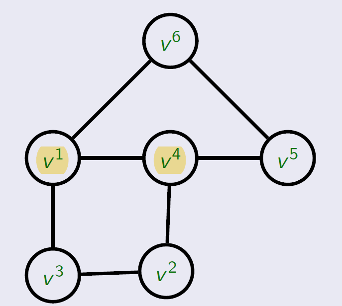
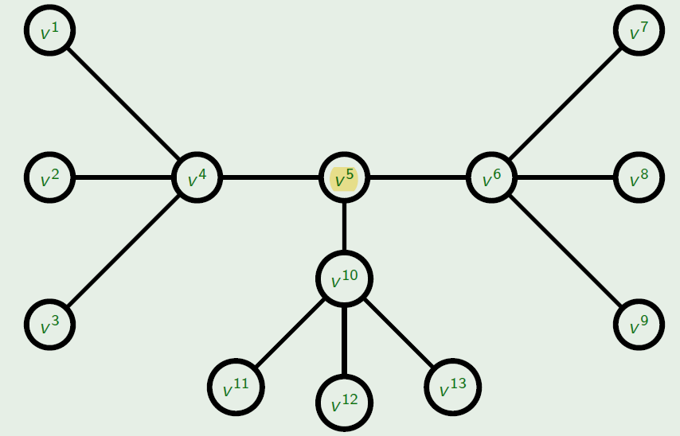
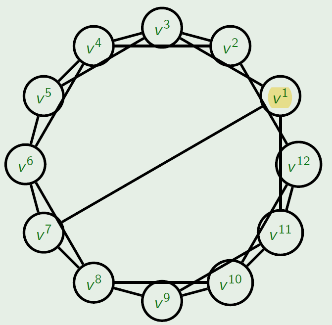
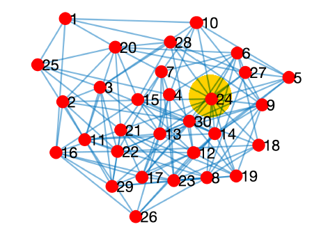

# Network Analysis & Graph Theory

## 1. Graph Theory Foundations

### Core definitions
- **Graph**: An ordered pair $G = (V, E)$ where
  - $V$ = set of nodes/vertices
  - $E \subseteq V \times V$ = set of unordered pairs called **edges**
- **Endpoints** of an edge $e = (v_i, v_j)$ are the vertices $v_i$ and $v_j$
- **Order** of a graph: $|V|$ (number of vertices)
- **Size** of a graph: $|E|$ (number of edges)

### Edge terminology
- **Link (side)**: edge where $v_i \neq v_j$ (distinct endpoints)
- **Loop**: edge where $v_i = v_j$ (starts and ends at same vertex)
- **Undirected edge** (edge): ordering irrelevant, $(v_i,v_j) = (v_j,v_i)$
- **Directed edge / arrow / arc**: ordering matters, $(v_i,v_j) \neq (v_j,v_i)$

### Directed graph
- A **directed graph (digraph)** is a graph in which **every** edge is directed:
  $G = (V, E)$ with $E \subseteq V \times V$ ordered pairs

### Adjacency
- Vertices $v_i, v_j$ are **adjacent** (neighbours) if $(v_i, v_j) \in E$ (There is an edge connecting them)
- Edge $(v_i, v_j)$ is **incident** on $v_i$ and $v_j$
- **Adjacency matrix** $A_G$: $|V| \times |V|$ square matrix where

$$
A_G(v_i, v_j) =
  \begin{cases}
    1 & \text{if } (v_i, v_j) \in E \\
    0 & \text{otherwise}
  \end{cases}
$$

  - For **undirected** graphs $A_G$ is **symmetric**

### Network vs Graph (terminology)
- **Network**: applied object — relations among real‑world entities/components
- **Graph**: abstract mathematical object — topological structure
  - Possible to analyse a network without using graphs, though graph theory is the most common tool

### Key graph categories to know
(Many are non‑exclusive; a graph can belong to several.)
- By nodes: **sparse**, **dense**, **continuous**
- By edge weights: **weighted**, **unweighted**
- By edge direction: **undirected**, **directed**
- By multiplicity: **simple/single** (≤1 edge per pair), **multigraph** (>1 edge allowed)
- By traversal properties: **Eulerian**, **Hamiltonian**
- By cycles: **acyclic**, **cyclic**
- By topology: **planar**, **tree** (incl. **star**), etc.
- By degree/edge distribution: **random**, **small‑world**, **power‑law**, **scale‑free**

### Typical analysis problems
- **Centrality analysis** – find important nodes/edges (influence, resilience)
- **Community detection** – identify groups/communities (source tracing, social cohesion)
- **Positional analysis** – detect structurally equivalent roles
- **Dynamic analysis** – study network evolution & diffusion processes
- **Outlier analysis** – anomaly detection, classification
- **Economic/path analysis** – shortest paths, cost optimisation

---

## 2a. Centrality Analysis (Local Measures)

### Centrality analysis
- **Centrality analysis**: identifies the most **prominent nodes or edges** in a network according to a chosen importance metric (influence, resilience, popularity, etc.).
- Centrality **is not about the physical location** of a node; graphs have no intrinsic spatial coordinates.
- We focus on nodes, but many measures have **edge‑centrality** analogues.

### 1- Degree centrality

- **Node degree**: number of edges incident on a vertex $v$; denoted $\deg(v)$.
- **Degree centrality**: importance score proportional to $\deg(v)$. Simple but sensitive to:
  1. **Network density** – compare degree to others, not absolute number.
  2. **Directionality** – split into **in‑degree** $\deg^{-}(v)$ and **out‑degree** $\deg^{+}(v)$.
  3. **Edge weights** – replace count with **strength** $s(v)=\sum_j w_{ij}$.
  4. **Multiplicity** – in multigraphs, choose to (a) dichotomise or (b) treat multiplicity as weight.

Remember that:
- A **weighted graph** $G_W=(V,E,W)$ assigns a real value $w(e)$ to every edge; negative weights allowed.

- A **multigraph** $G=(V,E)$ allows **multiple edges (parallel edges)** between a pair of vertices; a simple graph forbids them.

### 2- Betweenness centrality

- Idea: a node is central if **many shortest‑path flows pass through it**.
- **Shortest path (geodesic)**: path with minimum edge count (or minimum weight in weighted graphs). Multiple shortest paths may exist.
- **Freeman’s betweenness centrality** for node $v_k$:
  
$$
g(v_k)=\sum_{v_i
eq v_k}\sum_{v_j
eq v_k} 
rac{\sigma(v_i,v_j\mid v_k)}{\sigma(v_i,v_j)}
$$    

  where $\sigma(v_i,v_j)$ is the number of shortest paths between $v_i$ and $v_j$ and $\sigma(v_i,v_j\mid v_k)$ is those that pass through $v_k$.
  - If $v_i=v_j$: $\sigma(v_i,v_j)=1$
  - If $v_k$ is an endpoint: $\sigma(v_i,v_j\mid v_k)=0$

### Path & chain terminology
| Type | Vertices can repeat? | Edges can repeat? | Open/Closed | Directed? |
|------|----------------------|-------------------|-------------|-----------|
| **Walk** | ✓ | ✓ | Either | Either |
| **Trail** | ✓ | ✗ | Either | Either |
| **Circuit** | ✓ | ✗ | Closed | Either |
| **(Simple) Path** | ✗ | ✗ | Open | ✗ |
| **Directed path / trajectory** | ✗ | ✗ | Open | ✓ |
| **Cycle** | ✗ | ✗ | Closed | ✗ |
| **Directed cycle** | ✗ | ✗ | Closed | ✓ |

---

## 2b. Centrality Analysis (Global Measures)

### 3- Closeness Centrality

- **Idea**: A node is more central when it is, on average, closer (shortest‐path distance) to every other node, giving a truly *global* importance measure.
- **Unnormalised**: $CC(v_i)=\displaystyle\frac{1}{\sum_{v_j\in V} d(v_i,v_j)}$
- **Normalised** (common): $CC(v_i)=\displaystyle\frac{|V|-1}{\sum_{v_j\in V} d(v_i,v_j)}$
- **Notes**
  - Works with any distance metric (e.g., hop count, Dijkstra on weighted/directed graphs).
  - In disconnected graphs, treat unreachable distances as ∞ and set $1/\infty=0$ (Beauchamp correction).

### 4- Eigenvector Centrality (Eigencentrality)

- **Intuition**: “You’re important if you link to other important nodes.” Captures prestige beyond mere degree or betweenness.
- **Definition**: Dominant eigenvector of the adjacency matrix **A**.
  
$$
  x(v_i)=\frac{1}{\lambda}\sum_{j\in V} a_{ij}\,x(v_j)
$$
  
  where $\lambda$ is the largest eigenvalue.
- **Computation**: Solve $A p = \lambda p$; use the components of the eigenvector with the largest $\lambda$.

### 4b- PageRank
- **Concept**: A directed, damped variant of eigenvector centrality used in web ranking.
  - Influence is split equally among out‑links; being *linked *to* by high‑rank pages boosts your score.
  - Random‑surf damping prevents link‑farms (cyclotrons) and handles dangling pages.
- **Transition matrix**: $A_{\text{norm}} = \text{diag}(A\mathbf{e})^{-1} A$ (rows divided by out‑degree).
- **Iterative update** (damping factor $d\approx0.85$):
  
$$
  p^{(t)} = d\,A_{\text{norm}}^{\!T}p^{(t-1)} + (1-d)\,\mathbf{e}
$$
  
  where $\mathbf{e}$ is a personalization vector (often uniform).
- **Edge cases**
  - *Cyclotron*: self‑link loops artificially inflate rank; damping mitigates.
  - *Dangling pages*: redistribute their rank uniformly or connect them to a dummy sink/source node.

---

## 3a. Community Detection (Foundations)

### Community concept
- **Community (intuitive)**: subset of nodes with denser internal links than external ones.

### Formal community definitions
- **Strong community**: subgraph $V_c$ where $\forall v\in V_c:\; \deg_{V_c}(v) > \deg_{\lnot V_c}(v)$. (Every member is more connected inside than outside)
- **Weak community**: subgraph $V_c$ where $\sum_{v\in V_c} \deg_{V_c}(v) > \sum_{v\in V_c} \deg_{\lnot V_c}(v)$. (The group as a whole has more internal than external links, but individuals may not)
    - Every strong community is also weak, but not vice‑versa.

### Connectivity groundwork
- **Connected component (undirected)**: maximal subgraph in which any two vertices are joined by a path.
- **Connected graph**: exactly one connected component; equivalently, every non‑trivial vertex partition is bridged by at least one edge.

| Graph type | Definition | Key fact |
|------------|------------|----------|
| **Free graph** | Edge‑less graph ($E=\varnothing$) | $\omega(G)=\lvert V\rvert$ (each node isolated)  |
| **Complete graph** $K_n$ | All vertex pairs adjacent | $\|E\| = n(n-1)/2$; diameter = 0 ($n\le1$) else 1  |

- **Connected Graph vs. Complete Graph?**:
    - A graph is connected if there is a path between every pair of vertices.
    - A graph is complete if there is an edge directly connecting every pair of vertices.

- **Connected directed graphs**:
    - **Weakly connected digraph**: connected when arc directions are ignored.
    - **Strongly connected digraph**: directed path exists for every ordered vertex pair; strong ⇒ weak.

### Vulnerability concepts
- **Bridge / cut‑edge**: edge whose deletion increases the number of connected components, i.e. $\omega(G\setminus e) > \omega(G)$.
- **Cut vertex / articulation point**: vertex whose deletion increases $\omega$.

### Regularity & special graph families
- **k‑regular graph**: every vertex degree is the same $k$ ; impossible when both $k$ and $|V|$ are odd.
- **Bipartite graph**: vertices partitioned into $V_1,V_2$ with edges only across the partition. (Imagine a neural network)
- **Complete bipartite graph** $K_{n,m}$: every $v\in V_1$ adjacent to every $v\in V_2$.
- **Clique**: complete subgraph.

### Traversal algorithms
- **Depth‑First Search (DFS)**: Explores as far as possible along each branch before backtracking.
- **Breadth‑First Search (BFS)**: Explores all neighbors level by level before moving deeper.

---

## 3b. Community Detection (Trees, Modularity & Algorithms)

### Trees – must‑know facts
- **Intuitive**: A tree is a graph where every two vertices are connected by exactly one simple path.
- **Formal**: simple, undirected, connected, and acyclic graph $G=(V,E)$.
- Alternate characterisation (equivalent conditions):
  - Adding any missing edge creates exactly one cycle.
  - Removing any edge disconnects the graph.
- **Degree terminology**:
  - $\deg(v) \ge 2$ ⇒ *internal* vertex
  - $\deg(v) = 1$ ⇒ *external* / *leaf*
- **Edge / vertex count**: connected finite tree satisfies $|V| = |E| + 1$.
- **Binary‑merge dendrogram**: a tree with $n$ leaves has $2n-1$ total nodes (important when reading community dendrograms).

### Modularity – quality of a partition
- **Concept**:
    - “How much denser are the edges *inside* the proposed communities than we would expect if we randomly rewired the same graph while keeping every node’s degree the same?”
- **Why compare to random?**
    - Simply counting intra-community edges is misleading—dense regions can appear just because some nodes have high degree.
    - Modularity subtracts out that “baseline” density, so a high score means the partition reveals structure *beyond* what node degrees alone can explain.

- **Core formula (unweighted, Newman-Girvan):**  
  $$Q = \sum_{i} \bigl( m_{ii} - m_i^{\,2} \bigr)$$  
  where  
  - $$m_{ii}$$ is the fraction of all edges whose **both** endpoints lie in community $$i$$, and  
  - $$m_i = \sum_j m_{ij}$$ is the total edge fraction attached to community $$i$$.
 
- **Interpretation of $$Q$$:**  
  - $$Q \approx 1$$ → communities are very tight; far more internal edges than chance.  
  - $$Q \approx 0$$ → edges look random with respect to the partition.  
  - $$Q < 0$$ → edges cut across the partition more than expected, so the grouping is *anti-community*.  

- **Typical range:** $$[-\tfrac12,\,1)$$.  The theoretical upper bound of $$1$$ is rarely reached in real data; values above $$0.3$$ – $$0.4$$ already indicate meaningful structure for many networks.

### Algorithms used in (mapping communities → dendrogram) are either:
- **Agglomerative**: start with isolated vertices; iteratively **add** edges/merge clusters (leaves → root).
- **Divisive**: start with full graph; iteratively **remove** edges/split clusters (root → leaves).

### 1- Louvain algorithm (fast unfolding)

1. **Initialize**
   - Assign each node to its own community.

2. **Local Moving Phase**
   - For each node, consider moving it to the community of each of its neighbors.
   - Move the node to the community that gives the largest increase in modularity (if any).
   - Repeat until no node can be moved to increase modularity.

3. **Aggregation Phase**
   - Build a new network where each community becomes a single meta-node (meta-community).
   - The weights of the links between meta-nodes are the sum of the links between original communities.

4. **Repeat**
   - Apply the local moving phase and aggregation phase on the new network.
   - Continue until modularity can no longer be increased.

5. **Output**
   - The final partitioning of nodes into communities at the highest modularity.

**In short:**  
Local moving of nodes to optimize modularity → Group nodes into meta-communities → Repeat until stable.

**Pros**: scalable (≈ linear), reuses $\Delta Q$ updates.
**Cons**: result depends on node order; may get stuck in local maxima.

### 2- Girvan–Newman algorithm

1. For every edge, calculate **edge betweenness centrality** (number of shortest paths passing through each edge).
2. Remove the edge(s) with the highest betweenness.
3. Recalculate betweenness for the remaining edges.
4. Repeat steps 2-3 until no edges remain or until desired number of communities is found.
5. The algorithm produces a dendrogram (tree) showing how the network splits into communities as bridges are removed.

Variants: remove all max‑betweenness edges at once (faster) or one at a time (easier to follow).

**Key point:**  
Edges with high betweenness act as bridges between communities. Removing them reveals the underlying clusters.

---

## 4. Economic & Path Analysis

### Network economics
- **Diameter $D(G)$** – longest shortest-path in the graph; the farthest any two nodes are “hops” apart.  
- **Cost $K(G)$** – total pairwise distance
    - $K(G)=\displaystyle\sum_{v_i}\sum_{v_j\neq i} d(v_i,v_j)$
    - Lower $$K$$ ⇒ cheaper network to traverse.
- **Global efficiency ($E_{\text{glob}}$)** – average inverse distance
    - $E_{glob}(G)=\frac{1}{|V|(|V|-1)}\sum_{v_i}\sum_{v_j\neq i}\frac{1}{d(v_i,v_j)}$
    - Higher $$E_{\text{glob}}$$ ⇒ information flows faster overall.
- **Economy** – efficiency minus cost (both normalised)
    - $Economy(G)=E_{glob}^{\text{norm}}(G)-K^{\text{norm}}(G)$
    - Positive ⇒ sleek & cheap; negative ⇒ sluggish & pricey.
- **Cognitive burden** ≈ the inverse of economy: high cost + low efficiency means more mental effort to navigate the network.

### Shortest‑path algorithms (remember when to use which)

| Algorithm | Handles negative weights? | Scope | Complexity* | Notes |
|-----------|---------------------------|-------|-------------|-------|
| **Dijkstra** | No | Single‑source | $O(E\log V)$ | Fast, non‑neg weights only.  |
| **Floyd–Warshall** | Yes (no neg cycles) | All‑pairs | $O(V^3)$ | Simple triple loop.  |
| **Bellman–Ford** | Yes | Single‑source | $O(VE)$ | Detects negative cycles.  |

### Eulerian walks
- **Eulerian path**: path using every edge exactly once.
- **Eulerian cycle**: Eulerian path that returns to start.
- **Eulerian graph**: connected, all vertices even degree (undirected) or equal in/out degree (digraph).
- **Euler's Path Theorem**: an undirected graph has an Euler path iff it has 0 or 2 vertices of odd degree; if 2, path starts/ends at them.
- **Fleury’s Algorithm** (edge‑by‑edge construction):
  1. Ensure connectivity & 0/2 odd vertices.
  2. Start at an odd‑degree vertex if any.
  3. At each step pick a non‑bridge edge unless forced.
  4. Delete edges as you traverse; stop when none left.

### Hamiltonian walks
- **Hamiltonian path**: visits every vertex exactly once.
- **Hamiltonian cycle**: Hamiltonian path that ends at start.
- **Hamiltonian graph**: contains a Hamiltonian cycle; deciding existence is NP‑complete.
