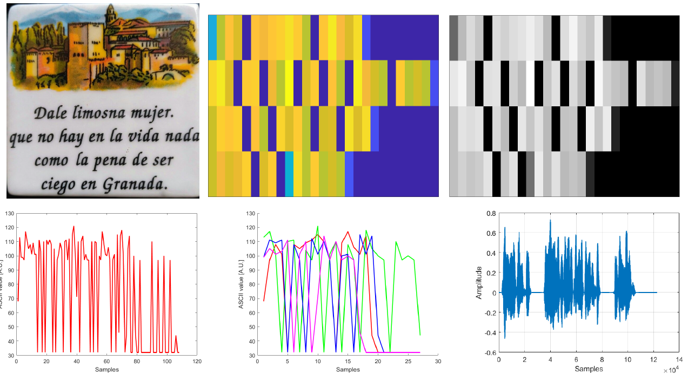
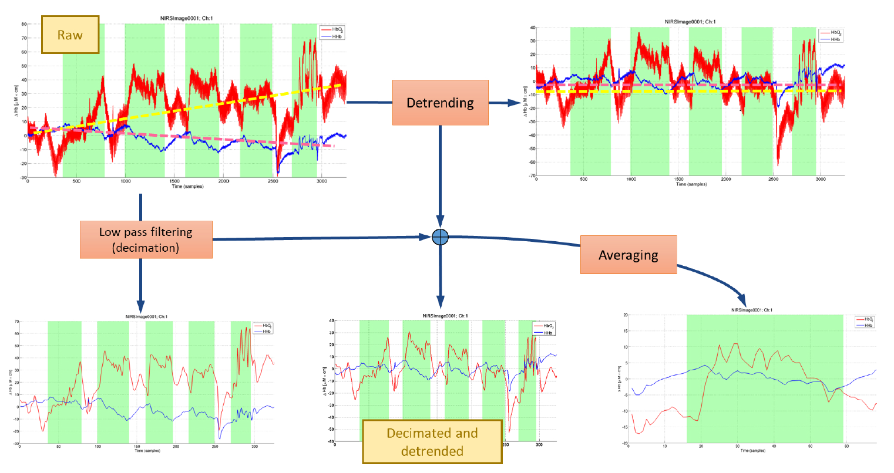

# Nature of Data: Introduction to Intelligent Data Analysis

[Listen to the AI generated overview podcast on this lecture!](https://notebooklm.google.com/notebook/414c1910-4899-4f7e-b8fe-b1f280274d39/audio)

## 1. Understanding the Nature of Data

Data representations, whether signals, images, videos, or text, are fundamentally equivalent from a mathematical perspective. Key insights include:
- **Points in Space**: All data can be treated as points in a structured set, regardless of its format.
- **Human-Defined Semantics**: The meaning of data is assigned by humans, while the format primarily affects ease of manipulation, not mathematical properties.
- **Representation Matters**: While the format does not impose mathematical limitations, it impacts the convenience of data manipulation.

---

## 2. Data as Points in Space
Data can be understood and analyzed through fundamental mathematical constructs.

### Sets and Elements
- **Definition**: A set is a finite or infinite collection of distinct objects, called elements or members, where order does not matter.
- **Key Point**: Data in any format (e.g., text, images, videos) can be represented as sets.

### Manipulating Sets
- **Operations on Sets**: Knowledge is extracted by applying operations to sets.
- **Relations as Actions**: Relations describe how elements in sets interact. For example:
  - "2 plus 2 equals 4" is a relation.
  - "The dog is green" is another relation.

### Cartesian Product
- **Definition**: Combines multiple sets into one by creating ordered tuples. For example:
  - \( A = \{1, 2\}, B = \{x, y\} \)
  - \( A x B = \{(1, x), (1, y), (2, x), (2, y)\} \).
- **Implications**:
  - Multivariate data analysis often uses Cartesian products to combine dimensions into one.
  - Complex data structures like multimodal data fusion leverage Cartesian products at higher abstraction levels.

---

### Types of Relations
Relations, as subsets of Cartesian products, can have specific constraints:
1. **Functions**: Each element in the domain maps to at most one image (e.g., variables).
2. **Orders**: Relations that are reflexive, transitive, and anti-symmetric.
3. **Equivalences**: Relations that are reflexive, transitive, and symmetric.
4. **Functors**: Relations where domains are themselves functions.
5. **Operations**: Relations applied to powers of a set.

### Representations of Relations
Relations can be represented in various ways:
1. Explicit sets.
2. Adjacency tables.
3. Graphs.
4. Tables of tuples.
5. Graphical depictions.

### From Sets to Spaces
- **Spaces**: A set becomes a space when operations are defined on it (e.g., vector spaces, groups, rings).
- **Points in Spaces**: Data elements can be treated as points in mathematical spaces, enabling structured operations.

---

## 3. Fundamentals of Data Analysis
Data analysis can be broken into two key activities:
1. **Processing**: Internal operations that enhance input data (e.g., filtering).
2. **Analysis**: External operations that extract summary statistics or insights (e.g., Fourier analysis).

### Pipelines
- **Definition**: Chains of processing and analysis steps applied sequentially to data.
- **Key Considerations**:
  - **Order Matters**: Most operations are not commutative.
  - **Overprocessing**: Applying excessive operations can distort insights.

---

## 4. Properties and Measurements
### Intrinsic and Extrinsic Properties
- **Intrinsic Properties**: Independent of the environment.
  - Cardinality, density, dimensionality.
- **Extrinsic Properties**: Dependent on the environment.
  - Differentiability, continuity, separability.

### Measurement Systems and Scales
- **Identity**: Classifies objects.
- **Magnitude**: Establishes order.
- **Interval**: Measures consistent differences (e.g., temperature in Celsius).
- **Ratio**: Includes absolute zero (e.g., weight).

---

## 5. Variables and Descriptive Statistics
### Variables
- **Definition**: Describe relationships between data elements.
- **Types**:
  - Nominal: Categories without order.
  - Ordinal: Ordered categories.
  - Interval: Quantitative without a true zero.
  - Ratio: Quantitative with a true zero.

### Descriptive Statistics
- **Central Tendency**: Mean, median, mode.
- **Dispersion**: Variance, standard deviation.
- **Estimators**: Sample-based calculations for population statistics.

---

## 6. Signals and Noise
### Signals
- **Definition**: Structured relationships of observations over a lattice.
- **Order Importance**: The sequence of observations can affect interpretation.

### Noise and Descriptors
- **Key Metrics**:
  - Signal-to-Noise Ratio (SNR): Ratio of signal power to noise power.
  - Coefficient of Variation (CV): Ratio of dispersion to mean.
- **Types of Noise**:
  - Coloured Noise: White, pink, red.
  - Distribution-Based Noise: Gaussian, Poisson.

