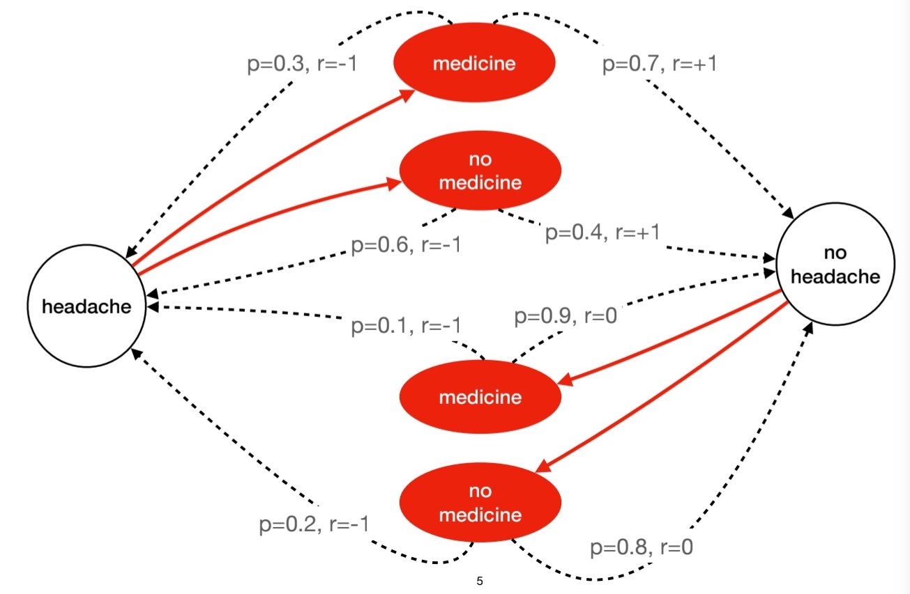

# Probabilistic Reasoning & Markov Decision Processes  

> *“Good decisions flow from clear probabilities and long‑term thinking.”*  

Modern AI systems—and the humans who use them—must make good choices in the face of uncertainty. Two fundamental toolkits help:
- Bayesian reasoning — using evidence to update beliefs about how likely something is.
- Markov Decision Processes (MDPs) — formal road-maps for picking actions over time when results depend on both choice and chance.

## 1.  Bayes Made Intuitive  

### 1.1  The theorem in plain English  
> **Posterior = (Evidence if theory true × Base rate) ÷ Overall evidence.**

Mathematically  

$$P(H\\mid E)=\\frac{{P(E\\mid H)\\,P(H)}}{{P(E)}}$$

### 1.2  Worked example using natural frequencies  
| People (out of 1 000) | Test outcome | Disease Q status | Count |
|-----------------------|--------------|------------------|-------|
| Have Q                | **Positive** | Diseased         | 9     |
| Have Q                | Negative     | Diseased         | 1     |
| Healthy               | **Positive** | Healthy          | 89    |
| Healthy               | Negative     | Healthy          | 901   |

Only **9 of the 98 positives** actually have the disease → probability ≈ **9 %**.  

### 1.3  Why natural frequencies beat percentages  
Natural counts keep base rates visible and dodge denominator neglect, a prime cause of “statistical illiteracy” in medicine.

Present numbers as simple counts (“9 out of 10”) instead of tricky percentages. Humans then answer Bayes problems far better. 

| **Statistic Style** | **Example for Disease Q** | **Cognitive Load** |
|---------------------|---------------------------|--------------------|
| Conditional %       | “Sensitivity = 90 %, False-positive = 9 %” | High |
| Natural frequency   | “Out of 1,000 people, 10 have Q; 9 of them test positive; 89 healthy people also test positive.” | Low |


---

## 2.  Markov Foundations  

### 2.1  Markov Chain recap  
**Markov chain** — a sequence where tomorrow’s state depends only on today, not yesterday. Think weather: if it’s rainy today there’s a fixed chance it stays rainy tomorrow. 

### 2.2 Markov Decision Process (MDP) — *A Markov chain with choices*  
**MDP** — a Markov chain plus *actions* and *rewards* so an “agent” can seek long-term gain. Plainly: a game board where each move changes both your position and your score.


### 2.3  Anatomy of an MDP  
| Symbol | Meaning | Plain English |
|--------|---------|---------------|
| \$S\$ | States | Situations an agent can be in |
| \$A\$ | Actions | Choices available |
| \$P(s'\\mid s,a$\) | Transition | Chance the action lands you in state \$s'\$ |
| \$R(s,a)\$ | Reward | Immediate payoff for taking \$a\$ in \$s\$ |
| \$\\gamma\$ | **Discount factor** | How much tomorrow counts vs today (0 = myopic, 1 = far‑sighted) |
| \$\\pi\$ | Policy | Rule mapping each state to an action |

Finite‑ vs infinite‑**horizon** MDPs simply decide whether the game eventually ends or repeats forever.

---

## 3.  A Mini‑MDP Walk‑Through – The Headache Dilemma  



| State | Action | → State | Probability | Reward |
|-------|--------|---------|-------------|--------|
| Headache | Take pill | No‑headache | 0.7 | +1 |
| Headache | Take pill | Headache | 0.3 | –1 |
| Headache | Wait      | No‑headache | 0.2 | –1 |
| Headache | Wait      | Headache   | 0.8 | –1 |
| No‑headache | — (similar probabilities omitted for brevity) | | |

1. **Initial values** \$V_0(s)=0\$.  
2. **First sweep (γ = 0.9).**

$$
V_1(\text{Headache}) =
\max \begin{cases}
0.7(1)+0.3(-1)=0.4 & \text{(take pill)}\\
0.2(-1)+0.8(-1)=-1 & \text{(wait)}
\end{cases}
$$


So \$V_1(\text{Headache})=0.4\$; further sweeps converge to the optimal **policy** “take pill if headache”.


### 3.1 Bellman Equation — *Value in two parts*  
**Bellman value** \$V^\* (s)\$ — best long-run reward you can still earn from state \$s\$:     

$$V^\*(s)=\max_{a\in A}\Big( R(s,a)+\gamma\sum_{s'}P(s'\mid s,a)\,V^\*(s') \Big)$$      

Plain English: Pick the action whose *immediate* reward plus the *discounted* future goodies is largest. 

---

## 4.  How to Solve an MDP – Cheat‑Sheet  

### 4.1 Algorithms Commonly Used to Solve an MDP

- **Value Iteration** – sweep state-values until they converge.  
- **Policy Iteration** – alternate between policy evaluation and improvement.  
- **Q-Learning** – learn action-values directly from experience (model-free).  
- **Reinforcement Learning (RL)** – umbrella term for trial-and-error learning with rewards.  
- **Deep Reinforcement Learning (DRL)** – pair RL with deep neural networks for high-dimensional inputs.  
- **Proximal Policy Optimisation (PPO)** – stable, clipped-update DRL algorithm that works well out-of-the-box.  
- **…etc.**

### 4.2  Value Iteration Algorithm
```text
# Value Iteration
Inputs: a MDP with state S, action A(s), transition model P(s'|s, a), rewards R(s), discount γ
repeat
    Δ ← 0
    for each state s:
        v ← V[s]
        V[s] ← max_a Σ_{s'} P(s'|s,a)[ R(s,a) + γ V[s'] ]
        Δ ← max(Δ, |v - V[s]|)
until Δ < ε
π(s) ← argmax_a Σ_{s'} P(s'|s,a)[ R(s,a) + γ V[s'] ]
```

---

## 5.  Partial Observability in Medicine  

Researchers built MDPs to choose when to start statin therapy, accept a liver donation, or adjust diabetes meds so lifetime quality (measured in Quality-Adjusted Life Years, QALY) is maximized.

Partially Observable MDP (POMDP) — like an MDP but you can’t see the true state; you hold a belief state (probability distribution) instead.

A 2013 framework embedded MDP/POMDP logic into a multi-agent system that simulates physicians and patients, optimizing a utility called Cost Per Unit Change (CPUC): money spent to improve one unit of health.Results beat treatment-as-usual.


---

## 6.  Stat‑Literacy Corner – Say Risks Clearly  

| **Old framing** | **Transparent framing** |
|-----------------|-------------------------|
| “Cuts risk by 50 %” | “From 2 % down to **1 %** (absolute)” |
| 5‑year survival | Mortality rate |
| Conditional %s | Natural counts (e.g., 9 of 1 000) |
| Benefits in relative terms, harms in absolute | Show both sides in the **same units** |

These fixes stop manipulative hype and empower shared decisions.

---

## 7.  Glossary  

| Term | Quick meaning |
|------|---------------|
| Natural frequency | Count out of a fixed population (e.g., 9/1 000) |
| \$γ\$ | Discount factor (0–1) |
| Policy (π) | Decision rule mapping states → actions |
| Belief state | Probabilistic guess of the hidden true state |
