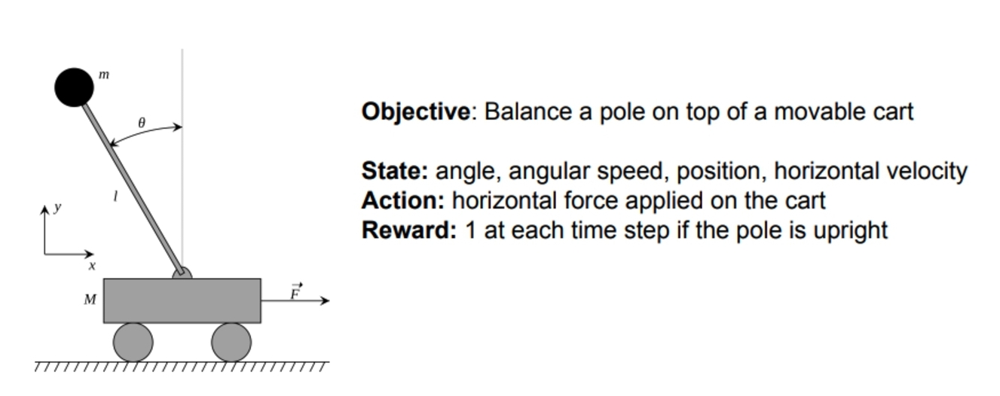

# Reinforcement Learning


## 1. What Is Reinforcement Learning?

**Reinforcement Learning (RL)** is a branch of machine learning in which a software **agent** learns a **behavior policy** by **trial‑and‑error** within an **environment**.  
- The agent chooses an **action** (e.g., steer left).  
- The environment responds with a **new state** and a **numerical reward**.  
- Over many episodes the agent discovers a strategy that **maximizes the long‑term sum of rewards**.

Think of teaching a puppy: sit, treat; jump on the couch, scold. The puppy’s “policy” is whatever sequence of moves now yields the most snacks over its lifetime.

---

## 2.RL Importance

| Reality | Why Classical Software Struggles | RL Advantage |
|------------------|----------------------------------|--------------|
| **Complex, high‑dimensional worlds** (autonomous driving, 3D robotics) | Enumerating every rule is impossible. | RL **learns rules** instead of hard‑coding them. |
| **Dynamic Environments** (finance, ads, energy) | Hand‑tuned heuristics become stale. | RL **updates its policy on‑line** as the world shifts. |
| **Sparse feedback** (long games, supply‑chain cycles) | Supervised labels are scarce or delayed. | RL optimizes for **delayed, aggregate rewards**. |

Bottom line: RL turns volatility into algorithmic competitive advantage.

---

## 3. Core Ingredients — A Shared Vocabulary
> *Building the language:* before we juggle equations, let’s agree on names for the pieces we’ll keep rearranging. Note we have already covered most of them last week.


| Term | Technical Definition | Everyday Analogy |
|---------------|----------------------|------------------|
| **Agent** | Algorithm that acts | You playing chess |
| **Environment** | Everything outside agent control | The chess board + opponent |
| **State (s)** | Snapshot of the environment | Current board layout |
| **Action (a)** | Choice available to the agent | Move a knight |
| **Reward (r)** | Scalar feedback | +1 for checkmate, −1 for blunder |
| **Policy (π)** | Rule mapping states → actions | “If early‑game & center open → develop knights.” |
| **Episode** | Sequence from start to terminal state | One full chess game |


### 3.1 Cart-pole problem (exmaple)



---

## 4. The RL Feedback Loop
> *From nouns to verbs:* now that we know the pieces, let’s see them dance.

1. **Observe** the current state *s*.  
2. **Select** an action *a* (usually a mix of “best‑known” and “try something new”).  
3. **Execute** *a* and obtain reward *r* plus next state *s′*.  
4. **Update** internal value estimates or policy parameters.  
5. **Repeat** until an episode ends, then start over.

```text
┌────────────┐      action a       ┌──────────────────────┐
│   Agent    │ ──────────────────► │  Environment         │
│            │ ◄────────────────── │  state s′, reward r  │
└────────────┘   observation       └──────────────────────┘
```

---

## 5. Markov Decision Process (MDP) — Recap
> *Why formalize?* Mathematics lets us **prove** optimality instead of guessing.

An **MDP** is the 5‑tuple $$\langle S, A, P, R, \gamma \rangle$$

| Component | Description | Note |
|-----------|-------------|------|
| **S** | Set of states | Finite or continuous |
| **A** | Set of actions | May depend on state |
| **P(s′ \| s,a)** | Transition probability | “Loaded dice” of the world |
| **R(s,a)** | Immediate reward distribution | Could be noisy |
| **γ (0–1)** | Discount factor | How much tomorrow matters |

“Markov” says **the future depends only on now**, not the whole past. That makes planning tractable.

---

## 6. The Bellman Equations — Recap
> *Why we need them:* to **evaluate** how good a state or action is we must account for **all future rewards**. Bellman gives a recursive shortcut.

### State‑Value Form
$$V^{\*}(s)=\max_{a} \big[R(s,a)+\gamma \sum_{s′}P(s′\|s,a)\,V^{\*}(s′)\big]$$

### Action‑Value Form
$$Q^{\*}(s,a)=R(s,a)+\gamma \sum_{s′}P(s′\|s,a)\max_{a′}Q^{\*}(s′,a′)$$

Interpretation: present value = immediate gain + best discounted future.  
If **γ → 0**, the agent is myopic; if **γ → 1**, it plans like a pension fund.

---

## 7. RL Algorithm - Q‑Learning
> *Escaping the model:* what if **P** and **R** are unknown or huge? Learn value estimates directly from data.

### Update Rule
$$Q(s,a) \leftarrow (1-\alpha)\,Q(s,a) + \alpha\big[r + \gamma\max_{a′}Q(s′,a′)\big]$$

| Symbol | Meaning | Typical Range |
|--------|---------|---------------|
| **α** | Learning rate | 0.1 → 0.001 (often decayed) |
| **γ** | Discount factor | 0.9 → 0.99 |
| **ε** | Exploration rate (for ε‑greedy) | 1 → 0.05 |

```python
# Minimal pseudo‑code
for episode in episodes:
    s = env.reset()
    done = False
    while not done:
        a = ε_greedy(Q[s])
        s′, r, done = env.step(a)
        Q[s,a] = (1-α)*Q[s,a] + α*(r + γ*max_a′ Q[s′,a′])
        s = s′
```

#### 7.1 Grid‑World Toy Example  

| From State | To State | Reward | Updated Q |
|-----------:|---------:|-------:|----------:|
| 1 | 5 | +100 | 100 |
| 3 | 1 | 0 | 80 |

Even a zero‑reward move gains value if it reliably leads to the 100‑point goal.


---

## 8. Hyper‑Parameters — Tuning Knobs That Matter
> *From prototype to product:* small dials steer large systems. Treat them like first‑class citizens.

| Parameter | Role | Practical Tip |
|-----------|------|---------------|
| **α** learning rate | How fast new info overwrites old | Start high, decay gradually |
| **γ** discount | Short‑ vs long‑term focus | 0.95+ for strategic play |
| **ε** exploration | % random actions | Anneal exponentially |
| **Batch size** | Updates per step (in DQN, etc.) | Power of 2 (32–256) |
| **Episodes** | Training loops | 10³–10⁶+ depending on domain |

A/B‑test one knob at a time; interactions can be non‑linear.
